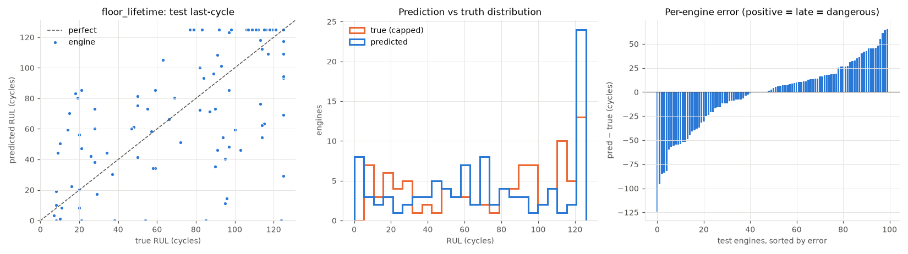
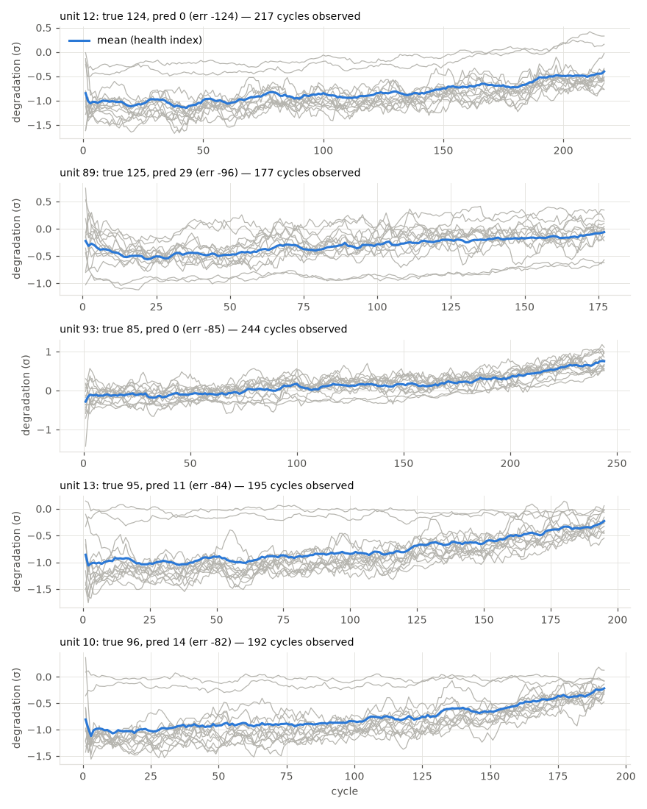

# floor_lifetime

RUL cap: **125**. Evaluated on the last observed cycle of each test engine (n=100).

| truth | RMSE | MAE | PHM08 score | mean bias |
|---|---|---|---|---|
| capped | 36.084 | 26.943 | 21032.4 | -2.22 |
| raw | 36.793 | 28.013 | 23169.9 | -3.29 |
| true RUL ≤ cap only (n=89) | 36.055 | 27.609 | 19365.7 | 0.17 |

**Distribution:** std ratio 1.035 (1.0 = same spread as truth), KS 0.14 (p=0.2819), pred range [0.0, 125.0] vs true [7.0, 125.0].

## Error by true-RUL bucket

| bucket         |   n |   rmse |   bias |
|:---------------|----:|-------:|-------:|
| [0.0, 25.0)    |  19 |  34.84 |  20.75 |
| [25.0, 50.0)   |  11 |  26.3  |  11.83 |
| [50.0, 75.0)   |  13 |  26.54 |   1.9  |
| [75.0, 100.0)  |  23 |  43.3  | -11.47 |
| [100.0, 125.0) |  23 |  37.73 | -11.75 |
| [125.0, inf)   |  11 |  36.32 | -21.56 |

## Worst engines

|   unit |   cycles_observed |   y_true |   y_true_raw |   y_pred |    err |
|-------:|------------------:|---------:|-------------:|---------:|-------:|
|     12 |               217 |      124 |          124 |      0   | -124   |
|     89 |               177 |      125 |          136 |     29.3 |  -95.7 |
|     93 |               244 |       85 |           85 |      0   |  -85   |
|     13 |               195 |       95 |           95 |     11.3 |  -83.7 |
|     10 |               192 |       96 |           96 |     14.3 |  -81.7 |

Grey lines: each informative sensor, z-scored with train-set stats, sign-flipped so up = toward failure, rolling mean over 10 cycles. Blue: their average. Sensors: s2 = Total temperature at LPC outlet (T24, °R), s3 = Total temperature at HPC outlet (T30, °R), s4 = Total temperature at LPT outlet (T50, °R), s7 = Total pressure at HPC outlet (P30, psia), s8 = Physical fan speed (Nf, rpm), s9 = Physical core speed (Nc, rpm), s11 = Static pressure at HPC outlet (Ps30, psia), s12 = Ratio of fuel flow to Ps30 (phi, pps/psi), s13 = Corrected fan speed (NRf, rpm), s14 = Corrected core speed (NRc, rpm), s15 = Bypass ratio (BPR), s17 = Bleed enthalpy (htBleed), s20 = HPT coolant bleed (W31, lbm/s), s21 = LPT coolant bleed (W32, lbm/s).
