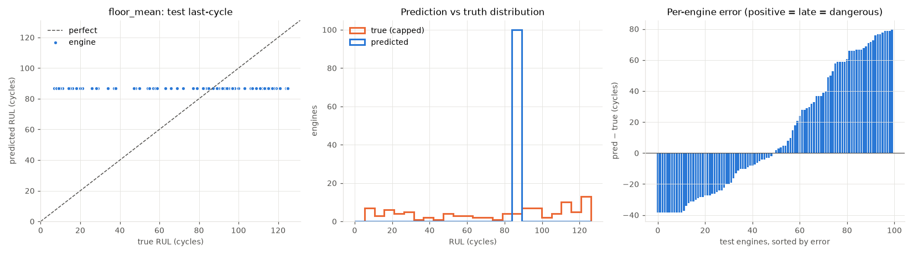
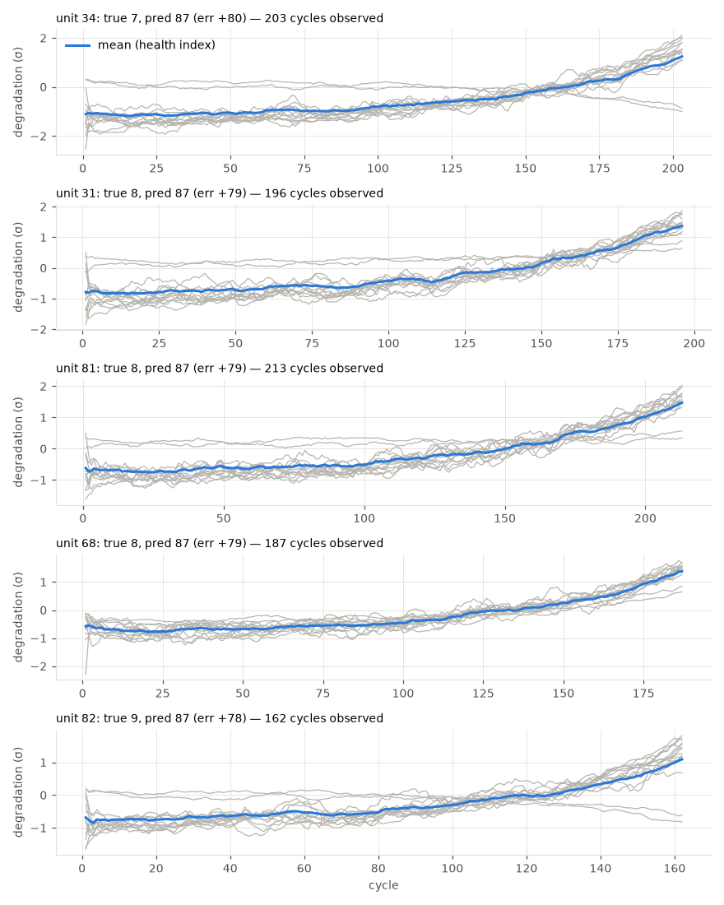

# floor_mean

RUL cap: **125**. Evaluated on the last observed cycle of each test engine (n=100).

| truth | RMSE | MAE | PHM08 score | mean bias |
|---|---|---|---|---|
| capped | 41.942 | 34.83 | 33354.5 | 12.379 |
| raw | 43.067 | 35.9 | 33629.2 | 11.309 |

**Distribution:** std ratio 0.0 (1.0 = same spread as truth), KS 0.5 (p=0.0), pred range [86.8, 86.8] vs true [7.0, 125.0].

## Error by true-RUL bucket

| bucket         |   n |   rmse |   bias |
|:---------------|----:|-------:|-------:|
| [0.0, 25.0)    |  19 |  72.49 |  72.3  |
| [25.0, 50.0)   |  11 |  53.63 |  53.1  |
| [50.0, 75.0)   |  13 |  29.05 |  28.21 |
| [75.0, 100.0)  |  23 |   6.79 |  -2.91 |
| [100.0, 125.0) |  23 |  26.68 | -26.08 |
| [125.0, inf)   |  11 |  38.17 | -38.17 |

## Worst engines

|   unit |   cycles_observed |   y_true |   y_true_raw |   y_pred |   err |
|-------:|------------------:|---------:|-------------:|---------:|------:|
|     34 |               203 |        7 |            7 |     86.8 |  79.8 |
|     31 |               196 |        8 |            8 |     86.8 |  78.8 |
|     81 |               213 |        8 |            8 |     86.8 |  78.8 |
|     68 |               187 |        8 |            8 |     86.8 |  78.8 |
|     82 |               162 |        9 |            9 |     86.8 |  77.8 |

Grey lines: each informative sensor, z-scored with train-set stats, sign-flipped so up = toward failure, rolling mean over 10 cycles. Blue: their average. Sensors: s2 = Total temperature at LPC outlet (T24, °R), s3 = Total temperature at HPC outlet (T30, °R), s4 = Total temperature at LPT outlet (T50, °R), s7 = Total pressure at HPC outlet (P30, psia), s8 = Physical fan speed (Nf, rpm), s9 = Physical core speed (Nc, rpm), s11 = Static pressure at HPC outlet (Ps30, psia), s12 = Ratio of fuel flow to Ps30 (phi, pps/psi), s13 = Corrected fan speed (NRf, rpm), s14 = Corrected core speed (NRc, rpm), s15 = Bypass ratio (BPR), s17 = Bleed enthalpy (htBleed), s20 = HPT coolant bleed (W31, lbm/s), s21 = LPT coolant bleed (W32, lbm/s).
