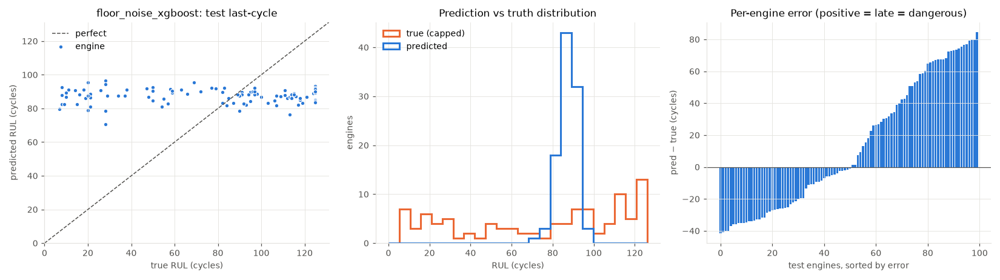
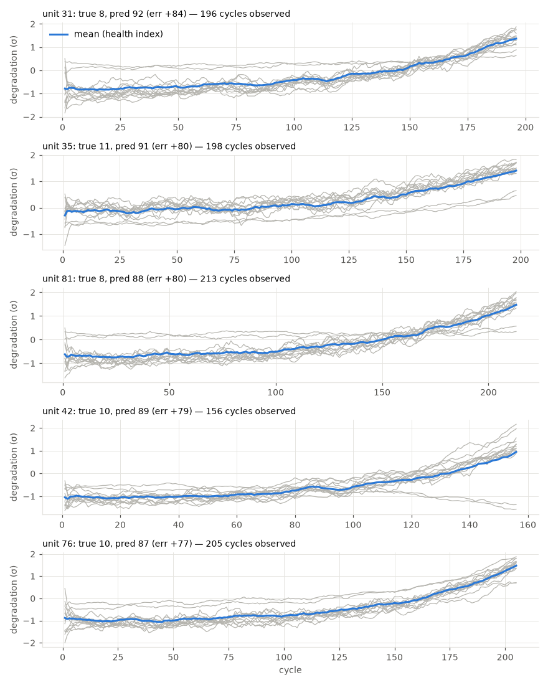

# floor_noise_xgboost

RUL cap: **125**. Evaluated on the last observed cycle of each test engine (n=100).

| truth | RMSE | MAE | PHM08 score | mean bias |
|---|---|---|---|---|
| capped | 42.28 | 35.267 | 36269.4 | 12.82 |
| raw | 43.34 | 36.337 | 36502.0 | 11.75 |
| true RUL ≤ cap only (n=89) | 42.939 | 35.133 | 36094.0 | 18.898 |

**Distribution:** std ratio 0.108 (1.0 = same spread as truth), KS 0.42 (p=0.0), pred range [70.5, 96.4] vs true [7.0, 125.0].

## Error by true-RUL bucket

| bucket         |   n |   rmse |   bias |
|:---------------|----:|-------:|-------:|
| [0.0, 25.0)    |  19 |  72.54 |  72.23 |
| [25.0, 50.0)   |  11 |  54.63 |  53.83 |
| [50.0, 75.0)   |  13 |  30.83 |  30.15 |
| [75.0, 100.0)  |  23 |   7.7  |  -2.36 |
| [100.0, 125.0) |  23 |  27.63 | -26.96 |
| [125.0, inf)   |  11 |  36.51 | -36.35 |

## Worst engines

|   unit |   cycles_observed |   y_true |   y_true_raw |   y_pred |   err |
|-------:|------------------:|---------:|-------------:|---------:|------:|
|     31 |               196 |        8 |            8 |     92.5 |  84.5 |
|     35 |               198 |       11 |           11 |     91   |  80   |
|     81 |               213 |        8 |            8 |     87.9 |  79.9 |
|     42 |               156 |       10 |           10 |     89.3 |  79.3 |
|     76 |               205 |       10 |           10 |     86.8 |  76.8 |

Grey lines: each informative sensor, z-scored with train-set stats, sign-flipped so up = toward failure, rolling mean over 10 cycles. Blue: their average. Sensors: s2 = Total temperature at LPC outlet (T24, °R), s3 = Total temperature at HPC outlet (T30, °R), s4 = Total temperature at LPT outlet (T50, °R), s7 = Total pressure at HPC outlet (P30, psia), s8 = Physical fan speed (Nf, rpm), s9 = Physical core speed (Nc, rpm), s11 = Static pressure at HPC outlet (Ps30, psia), s12 = Ratio of fuel flow to Ps30 (phi, pps/psi), s13 = Corrected fan speed (NRf, rpm), s14 = Corrected core speed (NRc, rpm), s15 = Bypass ratio (BPR), s17 = Bleed enthalpy (htBleed), s20 = HPT coolant bleed (W31, lbm/s), s21 = LPT coolant bleed (W32, lbm/s).
