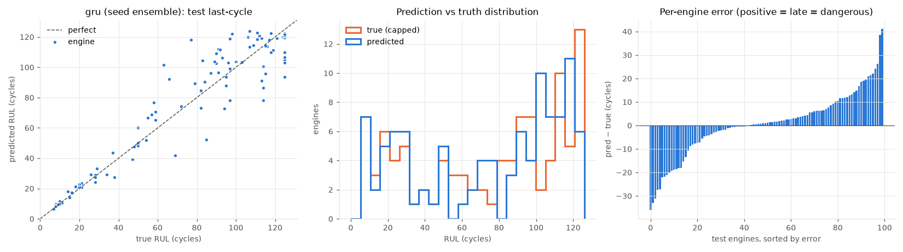
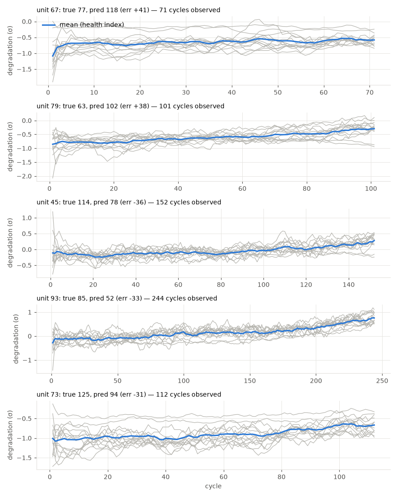

# gru (seed ensemble)

RUL cap: **125**. Evaluated on the last observed cycle of each test engine (n=100).

| truth | RMSE | MAE | PHM08 score | mean bias |
|---|---|---|---|---|
| capped | 13.697 | 9.708 | 310.9 | 0.648 |
| raw | 15.068 | 10.778 | 351.9 | -0.422 |
| true RUL ≤ cap only (n=89) | 13.236 | 9.118 | 279.8 | 2.517 |

**Distribution:** std ratio 0.987 (1.0 = same spread as truth), KS 0.12 (p=0.4695), pred range [6.6, 123.8] vs true [7.0, 125.0].

## Error by true-RUL bucket

| bucket         |   n |   rmse |   bias |
|:---------------|----:|-------:|-------:|
| [0.0, 25.0)    |  19 |   1.87 |   1.25 |
| [25.0, 50.0)   |  11 |   5.04 |  -1.13 |
| [50.0, 75.0)   |  13 |  17.18 |   8.18 |
| [75.0, 100.0)  |  23 |  17.8  |   7.04 |
| [100.0, 125.0) |  23 |  13.39 |  -2.42 |
| [125.0, inf)   |  11 |  16.97 | -14.48 |

## Worst engines

|   unit |   cycles_observed |   y_true |   y_true_raw |   y_pred |   err |
|-------:|------------------:|---------:|-------------:|---------:|------:|
|     67 |                71 |       77 |           77 |    118.1 |  41.1 |
|     79 |               101 |       63 |           63 |    101.5 |  38.5 |
|     45 |               152 |      114 |          114 |     78.1 | -35.9 |
|     93 |               244 |       85 |           85 |     52.1 | -32.9 |
|     73 |               112 |      125 |          131 |     93.8 | -31.2 |





Grey lines: each informative sensor, z-scored with train-set stats, sign-flipped so up = toward failure, rolling mean over 10 cycles. Blue: their average. Sensors: s2 = Total temperature at LPC outlet (T24, °R), s3 = Total temperature at HPC outlet (T30, °R), s4 = Total temperature at LPT outlet (T50, °R), s7 = Total pressure at HPC outlet (P30, psia), s8 = Physical fan speed (Nf, rpm), s9 = Physical core speed (Nc, rpm), s11 = Static pressure at HPC outlet (Ps30, psia), s12 = Ratio of fuel flow to Ps30 (phi, pps/psi), s13 = Corrected fan speed (NRf, rpm), s14 = Corrected core speed (NRc, rpm), s15 = Bypass ratio (BPR), s17 = Bleed enthalpy (htBleed), s20 = HPT coolant bleed (W31, lbm/s), s21 = LPT coolant bleed (W32, lbm/s).

## Run details

```json
{
  "per_seed_test_rmse": [
    14.243,
    14.269,
    14.707,
    14.296,
    13.471
  ],
  "seed_mean": 14.197,
  "seed_std": 0.401,
  "window": 30,
  "config": {
    "arch": "gru",
    "d_model": 64,
    "n_layers": 2,
    "dropout": 0.1,
    "lr": 0.001,
    "weight_decay": 0.0001,
    "batch": 256,
    "epochs": 60,
    "warmup": 2,
    "cosine": true,
    "patience": 0,
    "input_noise": 0.0
  },
  "features": [
    "s2",
    "s3",
    "s4",
    "s7",
    "s8",
    "s9",
    "s11",
    "s12",
    "s13",
    "s14",
    "s15",
    "s17",
    "s20",
    "s21",
    "age"
  ],
  "training": [
    {
      "val_rmse": [
        17.312,
        15.558,
        14.641,
        13.823,
        15.529,
        14.662,
        12.248,
        15.226,
        11.915,
        13.048,
        11.246,
        11.389,
        12.471,
        10.631,
        11.195,
        11.013,
        12.267,
        10.895,
        12.103,
        11.925,
        13.459,
        12.12,
        12.335,
        14.096,
        11.621,
        12.835,
        12.796,
        11.837,
        11.881,
        11.895,
        13.03,
        13.816,
        13.046,
        12.46,
        12.386,
        13.139,
        12.943,
        13.795,
        12.898,
        13.582,
        13.737,
        12.474,
        12.992,
        12.761,
        13.177,
        13.062,
        12.986,
        13.27,
        13.198,
        13.617,
        13.292,
        13.518,
        13.399,
        13.237,
        13.231,
        13.329,
        13.415,
        13.284,
        13.3,
        13.344
      ],
      "best_epoch": 13,
      "train_rmse": [
        58.616,
        18.198,
        15.496,
        13.398,
        12.755,
        12.834,
        12.143,
        12.11,
        11.907,
        11.471,
        11.481,
        11.393,
        10.974,
        10.851,
        10.564,
        10.277,
        10.12,
        9.846,
        9.851,
        9.352,
        9.362,
        9.092,
        8.924,
        8.75,
        8.624,
        8.359,
        8.514,
        8.075,
        8.111,
        8.142,
        7.72,
        7.625,
        7.597,
        7.481,
        7.259,
        7.175,
        7.128,
        7.034,
        6.929,
        6.785,
        6.739,
        6.624,
        6.643,
        6.561,
        6.593,
        6.455,
        6.402,
        6.331,
        6.278,
        6.31,
        6.28,
        6.219,
        6.221,
        6.167,
        6.219,
        6.13,
        6.154,
        6.126,
        6.088,
        6.132
      ],
      "seconds": 301
    },
    {
      "val_rmse": [
        21.216,
        19.877,
        21.979,
        16.73,
        14.803,
        15.19,
        13.913,
        13.779,
        13.971,
        13.266,
        13.671,
        12.732,
        12.92,
        13.234,
        13.437,
        13.151,
        12.884,
        13.144,
        13.794,
        12.957,
        13.762,
        13.497,
        13.608,
        13.536,
        13.682,
        13.842,
        13.238,
        13.726,
        14.326,
        13.753,
        13.992,
        14.117,
        13.934,
        13.891,
        14.331,
        14.221,
        14.367,
        14.307,
        14.492,
        14.418,
        14.16,
        14.45,
        14.484,
        14.512,
        14.516,
        14.373,
        14.227,
        14.423,
        14.657,
        14.51,
        14.577,
        14.453,
        14.501,
        14.531,
        14.51,
        14.511,
        14.518,
        14.535,
        14.548,
        14.535
      ],
      "best_epoch": 11,
      "train_rmse": [
        56.853,
        17.52,
        16.301,
        14.684,
        12.936,
        12.569,
        12.027,
        11.552,
        11.08,
        10.7,
        10.961,
        10.518,
        10.535,
        10.153,
        9.981,
        9.89,
        9.47,
        9.491,
        9.412,
        9.011,
        8.823,
        8.767,
        8.353,
        8.382,
        8.139,
        7.819,
        7.819,
        7.728,
        7.504,
        7.462,
        7.469,
        7.17,
        7.165,
        6.958,
        6.961,
        6.82,
        6.66,
        6.589,
        6.536,
        6.474,
        6.34,
        6.255,
        6.273,
        6.161,
        6.12,
        6.12,
        6.037,
        6.006,
        5.95,
        5.972,
        5.902,
        5.872,
        5.869,
        5.851,
        5.826,
        5.856,
        5.742,
        5.784,
        5.804,
        5.79
      ],
      "seconds": 286
    },
    {
      "val_rmse": [
        21.223,
        15.438,
        13.93,
        13.973,
        12.908,
        12.358,
        12.98,
        12.418,
        13.024,
        13.145,
        14.005,
        12.472,
        13.838,
        13.145,
        12.503,
        14.853,
        12.209,
        12.877,
        12.729,
        13.31,
        12.883,
        13.346,
        13.202,
        13.044,
        13.706,
        12.981,
        13.972,
        13.534,
        13.465,
        14.156,
        14.695,
        13.657,
        14.044,
        14.456,
        14.38,
        14.176,
        14.07,
        14.169,
        14.051,
        14.536,
        14.54,
        14.336,
        14.473,
        14.377,
        14.456,
        14.376,
        14.397,
        14.42,
        14.544,
        14.581,
        14.418,
        14.572,
        14.45,
        14.631,
        14.535,
        14.523,
        14.542,
        14.566,
        14.547,
        14.541
      ],
      "best_epoch": 16,
      "train_rmse": [
        58.507,
        18.619,
        15.459,
        13.192,
        12.473,
        12.314,
        11.843,
        11.857,
        11.462,
        11.513,
        11.222,
        11.429,
        10.977,
        10.526,
        10.384,
        10.081,
        10.439,
        9.672,
        9.563,
        9.66,
        9.362,
        8.998,
        8.85,
        8.769,
        8.514,
        8.575,
        8.485,
        8.263,
        8.038,
        8.02,
        8.061,
        7.933,
        7.6,
        7.568,
        7.697,
        7.272,
        7.243,
        7.165,
        7.153,
        6.993,
        6.964,
        6.955,
        6.909,
        6.821,
        6.739,
        6.62,
        6.695,
        6.553,
        6.527,
        6.502,
        6.532,
        6.477,
        6.407,
        6.41,
        6.353,
        6.352,
        6.37,
        6.325,
        6.344,
        6.401
      ],
      "seconds": 290
    },
    {
      "val_rmse": [
        19.758,
        14.175,
        14.95,
        11.257,
        12.663,
        12.284,
        11.363,
        11.328,
        10.865,
        12.207,
        10.528,
        10.092,
        10.0,
        9.778,
        10.623,
        10.879,
        10.685,
        11.054,
        9.839,
        10.962,
        11.736,
        10.712,
        10.498,
        11.981,
        13.526,
        11.662,
        11.55,
        11.651,
        11.594,
        11.288,
        10.821,
        13.17,
        11.893,
        12.329,
        12.101,
        11.749,
        12.365,
        12.373,
        12.098,
        12.38,
        12.955,
        12.402,
        11.834,
        12.28,
        12.546,
        12.02,
        12.208,
        12.811,
        12.249,
        12.274,
        12.256,
        12.354,
        12.553,
        12.429,
        12.586,
        12.456,
        12.475,
        12.477,
        12.557,
        12.527
      ],
      "best_epoch": 13,
      "train_rmse": [
        51.55,
        18.19,
        15.695,
        13.972,
        12.773,
        12.504,
        11.885,
        11.641,
        11.726,
        11.119,
        11.044,
        10.818,
        10.599,
        10.387,
        10.084,
        10.084,
        9.891,
        9.481,
        9.224,
        9.523,
        9.13,
        8.808,
        8.52,
        8.565,
        8.355,
        8.355,
        8.157,
        8.19,
        8.087,
        7.736,
        7.577,
        7.496,
        7.348,
        7.38,
        7.008,
        7.068,
        6.884,
        6.913,
        6.796,
        6.689,
        6.726,
        6.736,
        6.515,
        6.516,
        6.481,
        6.44,
        6.375,
        6.351,
        6.304,
        6.244,
        6.225,
        6.184,
        6.202,
        6.115,
        6.14,
        6.142,
        6.136,
        6.141,
        6.103,
        6.089
      ],
      "seconds": 286
    },
    {
      "val_rmse": [
        18.79,
        18.052,
        14.85,
        13.913,
        14.56,
        13.632,
        13.822,
        13.283,
        13.435,
        12.525,
        13.356,
        14.307,
        13.672,
        13.733,
        13.69,
        13.903,
        14.427,
        15.223,
        14.726,
        14.583,
        14.99,
        14.759,
        15.49,
        15.787,
        16.024,
        14.948,
        15.409,
        15.853,
        17.06,
        15.896,
        15.986,
        16.08,
        16.352,
        16.212,
        16.023,
        16.571,
        16.402,
        16.573,
        16.357,
        16.54,
        16.368,
        16.726,
        16.766,
        17.038,
        16.739,
        16.559,
        16.771,
        17.055,
        16.704,
        16.895,
        16.825,
        17.065,
        17.104,
        16.888,
        17.121,
        16.87,
        16.972,
        16.921,
        16.938,
        16.929
      ],
      "best_epoch": 9,
      "train_rmse": [
        61.119,
        17.901,
        15.032,
        13.782,
        12.77,
        12.292,
        11.919,
        11.846,
        11.419,
        11.31,
        11.019,
        10.644,
        10.552,
        10.237,
        10.242,
        9.891,
        9.488,
        9.229,
        9.104,
        8.667,
        8.509,
        8.312,
        8.223,
        8.094,
        7.932,
        7.848,
        7.803,
        7.656,
        7.429,
        7.289,
        7.146,
        6.991,
        7.002,
        6.742,
        6.726,
        6.708,
        6.541,
        6.469,
        6.37,
        6.386,
        6.247,
        6.221,
        6.151,
        6.147,
        6.105,
        6.025,
        5.993,
        5.942,
        5.938,
        5.896,
        5.84,
        5.818,
        5.775,
        5.756,
        5.764,
        5.706,
        5.749,
        5.748,
        5.729,
        5.74
      ],
      "seconds": 297
    }
  ]
}
```
