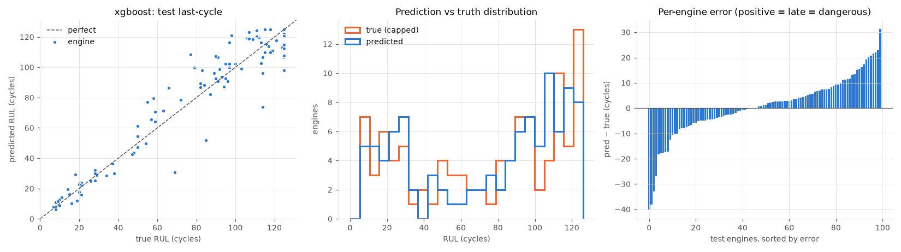
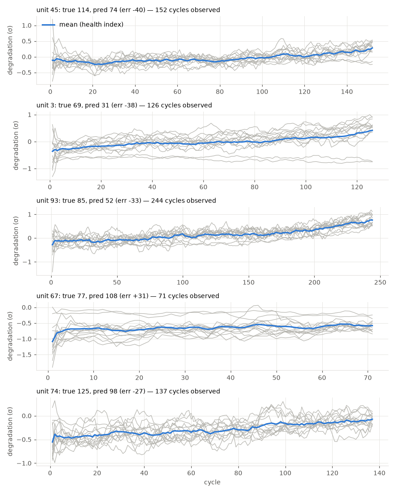

# xgboost

RUL cap: **125**. Evaluated on the last observed cycle of each test engine (n=100).

| truth | RMSE | MAE | PHM08 score | mean bias |
|---|---|---|---|---|
| capped | 11.924 | 8.582 | 208.7 | 0.702 |
| raw | 13.209 | 9.652 | 239.6 | -0.368 |
| true RUL ≤ cap only (n=89) | 11.593 | 8.212 | 186.8 | 2.218 |

**Distribution:** std ratio 0.995 (1.0 = same spread as truth), KS 0.09 (p=0.8154), pred range [6.1, 125.0] vs true [7.0, 125.0].

## Error by true-RUL bucket

| bucket         |   n |   rmse |   bias |
|:---------------|----:|-------:|-------:|
| [0.0, 25.0)    |  19 |   4.26 |   0.91 |
| [25.0, 50.0)   |  11 |   3.92 |  -1.63 |
| [50.0, 75.0)   |  13 |  16.03 |   5.7  |
| [75.0, 100.0)  |  23 |  14.06 |   6.05 |
| [100.0, 125.0) |  23 |  12.44 |  -0.67 |
| [125.0, inf)   |  11 |  14.33 | -11.57 |

## Worst engines

|   unit |   cycles_observed |   y_true |   y_true_raw |   y_pred |   err |
|-------:|------------------:|---------:|-------------:|---------:|------:|
|     45 |               152 |      114 |          114 |     73.8 | -40.2 |
|      3 |               126 |       69 |           69 |     30.8 | -38.2 |
|     93 |               244 |       85 |           85 |     52.1 | -32.9 |
|     67 |                71 |       77 |           77 |    108.3 |  31.3 |
|     74 |               137 |      125 |          126 |     98.1 | -26.9 |





Grey lines: each informative sensor, z-scored with train-set stats, sign-flipped so up = toward failure, rolling mean over 10 cycles. Blue: their average. Sensors: s2 = Total temperature at LPC outlet (T24, °R), s3 = Total temperature at HPC outlet (T30, °R), s4 = Total temperature at LPT outlet (T50, °R), s7 = Total pressure at HPC outlet (P30, psia), s8 = Physical fan speed (Nf, rpm), s9 = Physical core speed (Nc, rpm), s11 = Static pressure at HPC outlet (Ps30, psia), s12 = Ratio of fuel flow to Ps30 (phi, pps/psi), s13 = Corrected fan speed (NRf, rpm), s14 = Corrected core speed (NRc, rpm), s15 = Bypass ratio (BPR), s17 = Bleed enthalpy (htBleed), s20 = HPT coolant bleed (W31, lbm/s), s21 = LPT coolant bleed (W32, lbm/s).

## Run details

```json
{
  "cv_rmse_mean": 12.075,
  "cv_rmse_std": 1.385,
  "cv_rmse_folds": [
    14.66,
    10.59,
    11.34,
    12.11,
    11.66
  ],
  "features": [
    "cycle",
    "s2_last",
    "s2_mean",
    "s2_std",
    "s2_slope",
    "s3_last",
    "s3_mean",
    "s3_std",
    "s3_slope",
    "s4_last",
    "s4_mean",
    "s4_std",
    "s4_slope",
    "s7_last",
    "s7_mean",
    "s7_std",
    "s7_slope",
    "s8_last",
    "s8_mean",
    "s8_std",
    "s8_slope",
    "s9_last",
    "s9_mean",
    "s9_std",
    "s9_slope",
    "s11_last",
    "s11_mean",
    "s11_std",
    "s11_slope",
    "s12_last",
    "s12_mean",
    "s12_std",
    "s12_slope",
    "s13_last",
    "s13_mean",
    "s13_std",
    "s13_slope",
    "s14_last",
    "s14_mean",
    "s14_std",
    "s14_slope",
    "s15_last",
    "s15_mean",
    "s15_std",
    "s15_slope",
    "s17_last",
    "s17_mean",
    "s17_std",
    "s17_slope",
    "s20_last",
    "s20_mean",
    "s20_std",
    "s20_slope",
    "s21_last",
    "s21_mean",
    "s21_std",
    "s21_slope"
  ]
}
```
