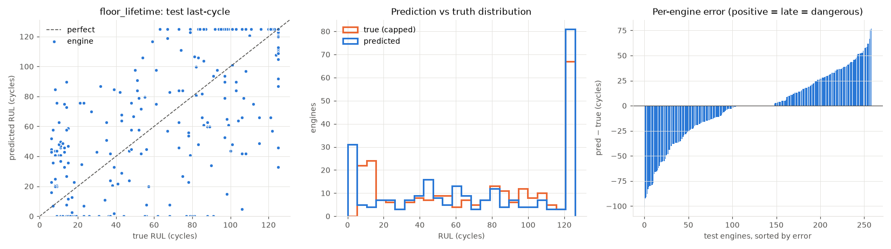
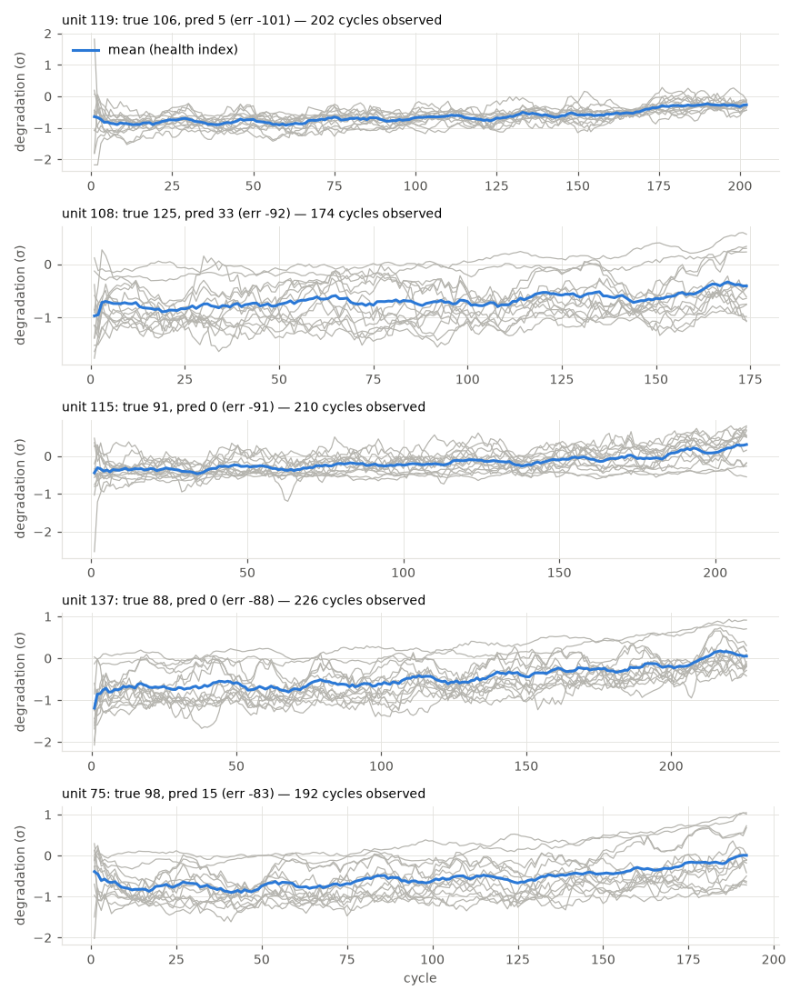

# floor_lifetime

RUL cap: **125**. Evaluated on the last observed cycle of each test engine (n=259).

| truth | RMSE | MAE | PHM08 score | mean bias |
|---|---|---|---|---|
| capped | 34.218 | 25.418 | 21565.0 | -0.748 |
| raw | 40.31 | 32.912 | 73500.1 | -8.243 |
| true RUL ≤ cap only (n=202) | 37.521 | 30.844 | 19872.1 | 0.787 |

**Distribution:** std ratio 1.055 (1.0 = same spread as truth), KS 0.12 (p=0.0489), pred range [0.0, 125.0] vs true [6.0, 125.0].

## Error by true-RUL bucket

| bucket         |   n |   rmse |   bias |
|:---------------|----:|-------:|-------:|
| [0.0, 25.0)    |  58 |  33.6  |  20.81 |
| [25.0, 50.0)   |  29 |  28.24 |  -0.84 |
| [50.0, 75.0)   |  31 |  41.88 |   7.66 |
| [75.0, 100.0)  |  48 |  44.11 | -13.77 |
| [100.0, 125.0) |  36 |  36.53 | -16.68 |
| [125.0, inf)   |  57 |  18.2  |  -6.19 |

## Worst engines

|   unit |   cycles_observed |   y_true |   y_true_raw |   y_pred |    err |
|-------:|------------------:|---------:|-------------:|---------:|-------:|
|    119 |               202 |      106 |          106 |      4.8 | -101.2 |
|    108 |               174 |      125 |          168 |     32.8 |  -92.2 |
|    115 |               210 |       91 |           91 |      0   |  -91   |
|    137 |               226 |       88 |           88 |      0   |  -88   |
|     75 |               192 |       98 |           98 |     14.8 |  -83.2 |

Grey lines: each informative sensor, z-scored with train-set stats, sign-flipped so up = toward failure, rolling mean over 10 cycles. Blue: their average. Sensors: s2 = Total temperature at LPC outlet (T24, °R), s3 = Total temperature at HPC outlet (T30, °R), s4 = Total temperature at LPT outlet (T50, °R), s7 = Total pressure at HPC outlet (P30, psia), s8 = Physical fan speed (Nf, rpm), s9 = Physical core speed (Nc, rpm), s11 = Static pressure at HPC outlet (Ps30, psia), s12 = Ratio of fuel flow to Ps30 (phi, pps/psi), s13 = Corrected fan speed (NRf, rpm), s14 = Corrected core speed (NRc, rpm), s15 = Bypass ratio (BPR), s17 = Bleed enthalpy (htBleed), s20 = HPT coolant bleed (W31, lbm/s), s21 = LPT coolant bleed (W32, lbm/s).
