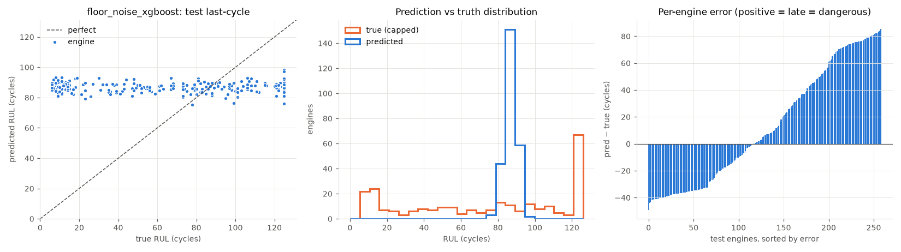
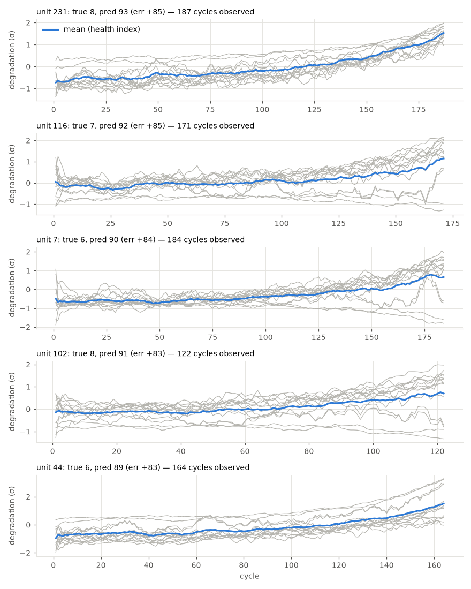

# floor_noise_xgboost

RUL cap: **125**. Evaluated on the last observed cycle of each test engine (n=259).

| truth | RMSE | MAE | PHM08 score | mean bias |
|---|---|---|---|---|
| capped | 44.988 | 38.006 | 126777.0 | 13.188 |
| raw | 54.107 | 45.5 | 167884.9 | 5.694 |
| true RUL ≤ cap only (n=202) | 46.864 | 38.173 | 125779.0 | 27.466 |

**Distribution:** std ratio 0.077 (1.0 = same spread as truth), KS 0.483 (p=0.0), pred range [75.2, 98.2] vs true [6.0, 125.0].

## Error by true-RUL bucket

| bucket         |   n |   rmse |   bias |
|:---------------|----:|-------:|-------:|
| [0.0, 25.0)    |  58 |  75.05 |  74.81 |
| [25.0, 50.0)   |  29 |  48.19 |  47.69 |
| [50.0, 75.0)   |  31 |  26.35 |  24.93 |
| [75.0, 100.0)  |  48 |   8.09 |  -1.01 |
| [100.0, 125.0) |  36 |  26.31 | -24.96 |
| [125.0, inf)   |  57 |  37.59 | -37.41 |

## Worst engines

|   unit |   cycles_observed |   y_true |   y_true_raw |   y_pred |   err |
|-------:|------------------:|---------:|-------------:|---------:|------:|
|    231 |               187 |        8 |            8 |     93.4 |  85.4 |
|    116 |               171 |        7 |            7 |     91.8 |  84.8 |
|      7 |               184 |        6 |            6 |     89.8 |  83.8 |
|    102 |               122 |        8 |            8 |     91   |  83   |
|     44 |               164 |        6 |            6 |     88.7 |  82.7 |

Grey lines: each informative sensor, z-scored with train-set stats, sign-flipped so up = toward failure, rolling mean over 10 cycles. Blue: their average. Sensors: s2 = Total temperature at LPC outlet (T24, °R), s3 = Total temperature at HPC outlet (T30, °R), s4 = Total temperature at LPT outlet (T50, °R), s7 = Total pressure at HPC outlet (P30, psia), s8 = Physical fan speed (Nf, rpm), s9 = Physical core speed (Nc, rpm), s11 = Static pressure at HPC outlet (Ps30, psia), s12 = Ratio of fuel flow to Ps30 (phi, pps/psi), s13 = Corrected fan speed (NRf, rpm), s14 = Corrected core speed (NRc, rpm), s15 = Bypass ratio (BPR), s17 = Bleed enthalpy (htBleed), s20 = HPT coolant bleed (W31, lbm/s), s21 = LPT coolant bleed (W32, lbm/s).
