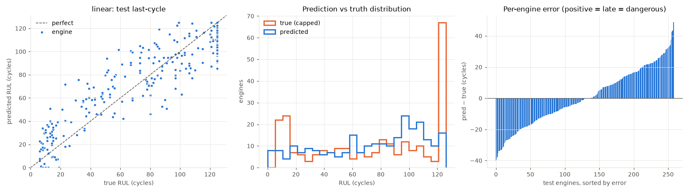
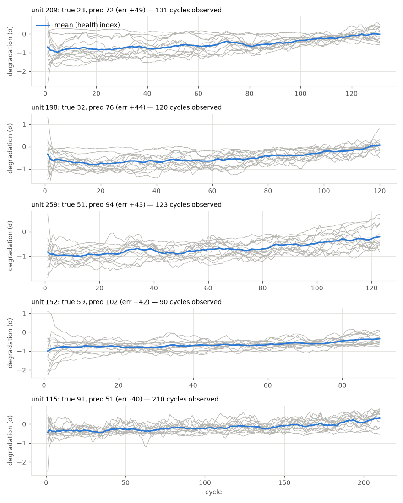

# linear

RUL cap: **125**. Evaluated on the last observed cycle of each test engine (n=259).

| truth | RMSE | MAE | PHM08 score | mean bias |
|---|---|---|---|---|
| capped | 18.445 | 15.329 | 1525.6 | 0.479 |
| raw | 30.6 | 22.823 | 12536.7 | -7.015 |
| true RUL ≤ cap only (n=202) | 18.143 | 15.019 | 1308.6 | 5.25 |

**Distribution:** std ratio 0.833 (1.0 = same spread as truth), KS 0.205 (p=0.0), pred range [0.0, 125.0] vs true [6.0, 125.0].

## Error by true-RUL bucket

| bucket         |   n |   rmse |   bias |
|:---------------|----:|-------:|-------:|
| [0.0, 25.0)    |  58 |  16.38 |   9.29 |
| [25.0, 50.0)   |  29 |  18.68 |  14.5  |
| [50.0, 75.0)   |  31 |  23    |  16.52 |
| [75.0, 100.0)  |  48 |  17.47 |  -0.67 |
| [100.0, 125.0) |  36 |  16.46 | -10.53 |
| [125.0, inf)   |  57 |  19.48 | -16.43 |

## Worst engines

|   unit |   cycles_observed |   y_true |   y_true_raw |   y_pred |   err |
|-------:|------------------:|---------:|-------------:|---------:|------:|
|    209 |               131 |       23 |           23 |     71.8 |  48.8 |
|    198 |               120 |       32 |           32 |     75.8 |  43.8 |
|    259 |               123 |       51 |           51 |     94.2 |  43.2 |
|    152 |                90 |       59 |           59 |    101.5 |  42.5 |
|    115 |               210 |       91 |           91 |     50.9 | -40.1 |





Grey lines: each informative sensor, z-scored with train-set stats, sign-flipped so up = toward failure, rolling mean over 10 cycles. Blue: their average. Sensors: s2 = Total temperature at LPC outlet (T24, °R), s3 = Total temperature at HPC outlet (T30, °R), s4 = Total temperature at LPT outlet (T50, °R), s7 = Total pressure at HPC outlet (P30, psia), s8 = Physical fan speed (Nf, rpm), s9 = Physical core speed (Nc, rpm), s11 = Static pressure at HPC outlet (Ps30, psia), s12 = Ratio of fuel flow to Ps30 (phi, pps/psi), s13 = Corrected fan speed (NRf, rpm), s14 = Corrected core speed (NRc, rpm), s15 = Bypass ratio (BPR), s17 = Bleed enthalpy (htBleed), s20 = HPT coolant bleed (W31, lbm/s), s21 = LPT coolant bleed (W32, lbm/s).

## Run details

```json
{
  "cv_rmse_mean": 20.389,
  "cv_rmse_std": 0.734,
  "cv_rmse_folds": [
    19.14,
    21.15,
    20.78,
    20.89,
    19.99
  ],
  "features": [
    "cycle",
    "s2_last",
    "s2_mean",
    "s2_std",
    "s2_slope",
    "s3_last",
    "s3_mean",
    "s3_std",
    "s3_slope",
    "s4_last",
    "s4_mean",
    "s4_std",
    "s4_slope",
    "s7_last",
    "s7_mean",
    "s7_std",
    "s7_slope",
    "s8_last",
    "s8_mean",
    "s8_std",
    "s8_slope",
    "s9_last",
    "s9_mean",
    "s9_std",
    "s9_slope",
    "s11_last",
    "s11_mean",
    "s11_std",
    "s11_slope",
    "s12_last",
    "s12_mean",
    "s12_std",
    "s12_slope",
    "s13_last",
    "s13_mean",
    "s13_std",
    "s13_slope",
    "s14_last",
    "s14_mean",
    "s14_std",
    "s14_slope",
    "s15_last",
    "s15_mean",
    "s15_std",
    "s15_slope",
    "s17_last",
    "s17_mean",
    "s17_std",
    "s17_slope",
    "s20_last",
    "s20_mean",
    "s20_std",
    "s20_slope",
    "s21_last",
    "s21_mean",
    "s21_std",
    "s21_slope"
  ]
}
```
