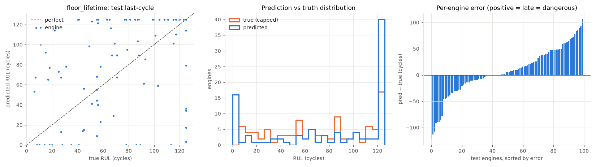
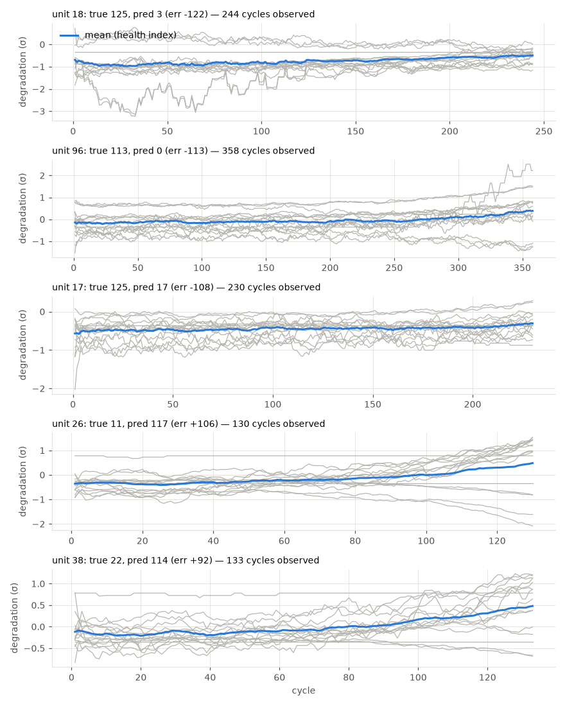

# floor_lifetime

RUL cap: **125**. Evaluated on the last observed cycle of each test engine (n=100).

| truth | RMSE | MAE | PHM08 score | mean bias |
|---|---|---|---|---|
| capped | 46.118 | 34.438 | 103388.2 | 6.706 |
| raw | 47.225 | 35.998 | 118455.5 | 5.146 |
| true RUL ≤ cap only (n=85) | 44.443 | 35.035 | 85637.1 | 13.369 |

**Distribution:** std ratio 1.229 (1.0 = same spread as truth), KS 0.23 (p=0.0099), pred range [0.0, 125.0] vs true [6.0, 125.0].

## Error by true-RUL bucket

| bucket         |   n |   rmse |   bias |
|:---------------|----:|-------:|-------:|
| [0.0, 25.0)    |  15 |  55.74 |  32.84 |
| [25.0, 50.0)   |  14 |  45.84 |  11.41 |
| [50.0, 75.0)   |  20 |  42.91 |  19.76 |
| [75.0, 100.0)  |  18 |  45.97 |   6.89 |
| [100.0, 125.0) |  18 |  30.73 |  -1.96 |
| [125.0, inf)   |  15 |  54.65 | -31.05 |

## Worst engines

|   unit |   cycles_observed |   y_true |   y_true_raw |   y_pred |    err |
|-------:|------------------:|---------:|-------------:|---------:|-------:|
|     18 |               244 |      125 |          132 |      3.2 | -121.8 |
|     96 |               358 |      113 |          113 |      0   | -113   |
|     17 |               230 |      125 |          136 |     17.2 | -107.8 |
|     26 |               130 |       11 |           11 |    117.2 |  106.2 |
|     38 |               133 |       22 |           22 |    114.2 |   92.2 |

Grey lines: each informative sensor, z-scored with train-set stats, sign-flipped so up = toward failure, rolling mean over 10 cycles. Blue: their average. Sensors: s2 = Total temperature at LPC outlet (T24, °R), s3 = Total temperature at HPC outlet (T30, °R), s4 = Total temperature at LPT outlet (T50, °R), s6 = Total pressure in bypass-duct (P15, psia), s7 = Total pressure at HPC outlet (P30, psia), s8 = Physical fan speed (Nf, rpm), s9 = Physical core speed (Nc, rpm), s10 = Engine pressure ratio P50/P2 (epr), s11 = Static pressure at HPC outlet (Ps30, psia), s12 = Ratio of fuel flow to Ps30 (phi, pps/psi), s13 = Corrected fan speed (NRf, rpm), s14 = Corrected core speed (NRc, rpm), s15 = Bypass ratio (BPR), s17 = Bleed enthalpy (htBleed), s20 = HPT coolant bleed (W31, lbm/s), s21 = LPT coolant bleed (W32, lbm/s).
