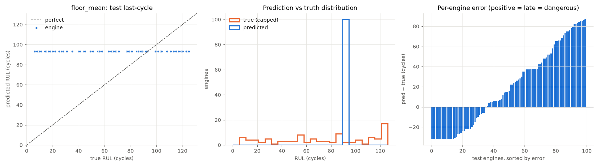
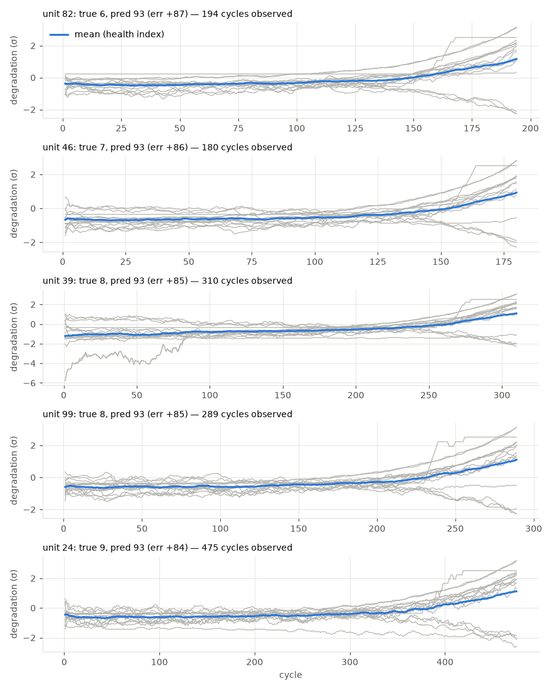

# floor_mean

RUL cap: **125**. Evaluated on the last observed cycle of each test engine (n=100).

| truth | RMSE | MAE | PHM08 score | mean bias |
|---|---|---|---|---|
| capped | 43.7 | 36.443 | 57686.9 | 19.383 |
| raw | 45.07 | 38.003 | 57949.6 | 17.823 |
| true RUL ≤ cap only (n=85) | 45.471 | 37.252 | 57528.0 | 28.426 |

**Distribution:** std ratio 0.0 (1.0 = same spread as truth), KS 0.65 (p=0.0), pred range [93.1, 93.1] vs true [6.0, 125.0].

## Error by true-RUL bucket

| bucket         |   n |   rmse |   bias |
|:---------------|----:|-------:|-------:|
| [0.0, 25.0)    |  15 |  80.36 |  80.21 |
| [25.0, 50.0)   |  14 |  57.56 |  57    |
| [50.0, 75.0)   |  20 |  33.73 |  33.09 |
| [75.0, 100.0)  |  18 |   9.05 |   6.48 |
| [100.0, 125.0) |  18 |  21.42 | -20.19 |
| [125.0, inf)   |  15 |  31.86 | -31.86 |

## Worst engines

|   unit |   cycles_observed |   y_true |   y_true_raw |   y_pred |   err |
|-------:|------------------:|---------:|-------------:|---------:|------:|
|     82 |               194 |        6 |            6 |     93.1 |  87.1 |
|     46 |               180 |        7 |            7 |     93.1 |  86.1 |
|     39 |               310 |        8 |            8 |     93.1 |  85.1 |
|     99 |               289 |        8 |            8 |     93.1 |  85.1 |
|     24 |               475 |        9 |            9 |     93.1 |  84.1 |

Grey lines: each informative sensor, z-scored with train-set stats, sign-flipped so up = toward failure, rolling mean over 10 cycles. Blue: their average. Sensors: s2 = Total temperature at LPC outlet (T24, °R), s3 = Total temperature at HPC outlet (T30, °R), s4 = Total temperature at LPT outlet (T50, °R), s6 = Total pressure in bypass-duct (P15, psia), s7 = Total pressure at HPC outlet (P30, psia), s8 = Physical fan speed (Nf, rpm), s9 = Physical core speed (Nc, rpm), s10 = Engine pressure ratio P50/P2 (epr), s11 = Static pressure at HPC outlet (Ps30, psia), s12 = Ratio of fuel flow to Ps30 (phi, pps/psi), s13 = Corrected fan speed (NRf, rpm), s14 = Corrected core speed (NRc, rpm), s15 = Bypass ratio (BPR), s17 = Bleed enthalpy (htBleed), s20 = HPT coolant bleed (W31, lbm/s), s21 = LPT coolant bleed (W32, lbm/s).
