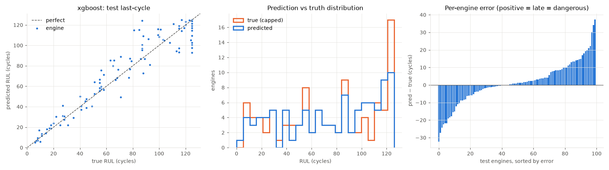
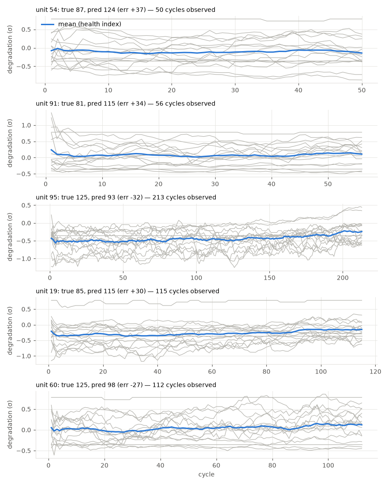

# xgboost

RUL cap: **125**. Evaluated on the last observed cycle of each test engine (n=100).

| truth | RMSE | MAE | PHM08 score | mean bias |
|---|---|---|---|---|
| capped | 12.116 | 8.614 | 238.9 | 1.33 |
| raw | 13.954 | 10.174 | 292.0 | -0.23 |
| true RUL ≤ cap only (n=85) | 11.471 | 8.144 | 203.4 | 3.556 |

**Distribution:** std ratio 0.97 (1.0 = same spread as truth), KS 0.13 (p=0.3682), pred range [5.0, 125.0] vs true [6.0, 125.0].

## Error by true-RUL bucket

| bucket         |   n |   rmse |   bias |
|:---------------|----:|-------:|-------:|
| [0.0, 25.0)    |  15 |   3.72 |   1.87 |
| [25.0, 50.0)   |  14 |   6.48 |  -0.2  |
| [50.0, 75.0)   |  20 |  12.11 |   6.82 |
| [75.0, 100.0)  |  18 |  17.38 |   9.62 |
| [100.0, 125.0) |  18 |  10.58 |  -1.81 |
| [125.0, inf)   |  15 |  15.27 | -11.28 |

## Worst engines

|   unit |   cycles_observed |   y_true |   y_true_raw |   y_pred |   err |
|-------:|------------------:|---------:|-------------:|---------:|------:|
|     54 |                50 |       87 |           87 |    124.3 |  37.3 |
|     91 |                56 |       81 |           81 |    115.1 |  34.1 |
|     95 |               213 |      125 |          127 |     92.8 | -32.2 |
|     19 |               115 |       85 |           85 |    115.3 |  30.3 |
|     60 |               112 |      125 |          128 |     97.8 | -27.2 |





Grey lines: each informative sensor, z-scored with train-set stats, sign-flipped so up = toward failure, rolling mean over 10 cycles. Blue: their average. Sensors: s2 = Total temperature at LPC outlet (T24, °R), s3 = Total temperature at HPC outlet (T30, °R), s4 = Total temperature at LPT outlet (T50, °R), s6 = Total pressure in bypass-duct (P15, psia), s7 = Total pressure at HPC outlet (P30, psia), s8 = Physical fan speed (Nf, rpm), s9 = Physical core speed (Nc, rpm), s10 = Engine pressure ratio P50/P2 (epr), s11 = Static pressure at HPC outlet (Ps30, psia), s12 = Ratio of fuel flow to Ps30 (phi, pps/psi), s13 = Corrected fan speed (NRf, rpm), s14 = Corrected core speed (NRc, rpm), s15 = Bypass ratio (BPR), s17 = Bleed enthalpy (htBleed), s20 = HPT coolant bleed (W31, lbm/s), s21 = LPT coolant bleed (W32, lbm/s).

## Run details

```json
{
  "cv_rmse_mean": 11.327,
  "cv_rmse_std": 1.335,
  "cv_rmse_folds": [
    10.66,
    11.1,
    10.47,
    13.95,
    10.45
  ],
  "features": [
    "cycle",
    "s2_last",
    "s2_mean",
    "s2_std",
    "s2_slope",
    "s3_last",
    "s3_mean",
    "s3_std",
    "s3_slope",
    "s4_last",
    "s4_mean",
    "s4_std",
    "s4_slope",
    "s6_last",
    "s6_mean",
    "s6_std",
    "s6_slope",
    "s7_last",
    "s7_mean",
    "s7_std",
    "s7_slope",
    "s8_last",
    "s8_mean",
    "s8_std",
    "s8_slope",
    "s9_last",
    "s9_mean",
    "s9_std",
    "s9_slope",
    "s10_last",
    "s10_mean",
    "s10_std",
    "s10_slope",
    "s11_last",
    "s11_mean",
    "s11_std",
    "s11_slope",
    "s12_last",
    "s12_mean",
    "s12_std",
    "s12_slope",
    "s13_last",
    "s13_mean",
    "s13_std",
    "s13_slope",
    "s14_last",
    "s14_mean",
    "s14_std",
    "s14_slope",
    "s15_last",
    "s15_mean",
    "s15_std",
    "s15_slope",
    "s17_last",
    "s17_mean",
    "s17_std",
    "s17_slope",
    "s20_last",
    "s20_mean",
    "s20_std",
    "s20_slope",
    "s21_last",
    "s21_mean",
    "s21_std",
    "s21_slope"
  ]
}
```
