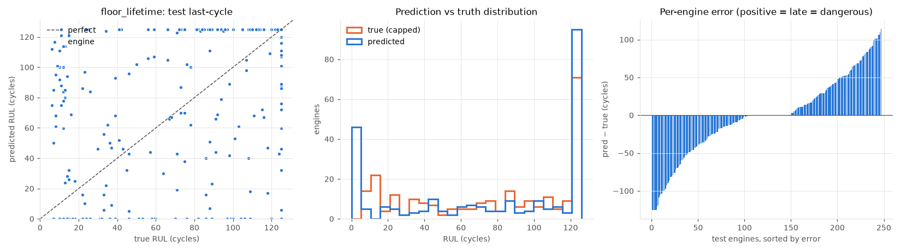
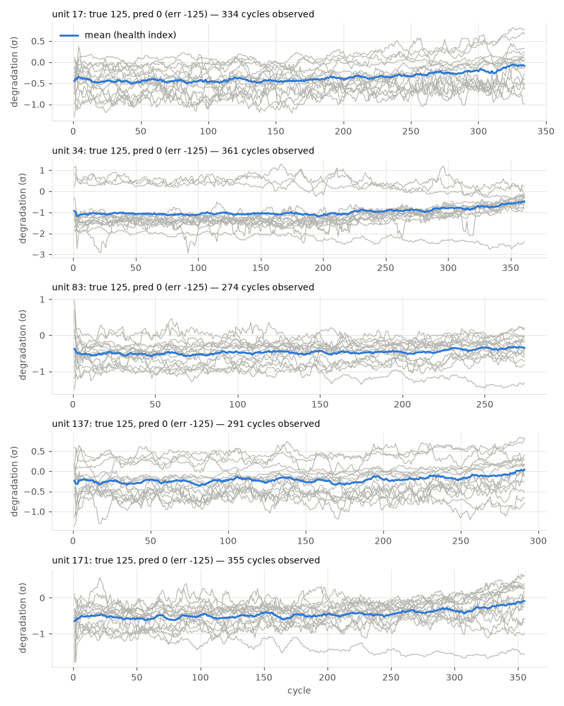

# floor_lifetime

RUL cap: **125**. Evaluated on the last observed cycle of each test engine (n=248).

| truth | RMSE | MAE | PHM08 score | mean bias |
|---|---|---|---|---|
| capped | 52.658 | 38.726 | 569516.0 | -1.171 |
| raw | 59.054 | 47.419 | 3084441.6 | -9.864 |
| true RUL ≤ cap only (n=181) | 55.11 | 45.258 | 468066.8 | 6.199 |

**Distribution:** std ratio 1.152 (1.0 = same spread as truth), KS 0.194 (p=0.0002), pred range [0.0, 125.0] vs true [6.0, 125.0].

## Error by true-RUL bucket

| bucket         |   n |   rmse |   bias |
|:---------------|----:|-------:|-------:|
| [0.0, 25.0)    |  49 |  64.08 |  43.97 |
| [25.0, 50.0)   |  30 |  45.95 |  11.62 |
| [50.0, 75.0)   |  26 |  49.22 |   7.34 |
| [75.0, 100.0)  |  41 |  50.63 | -11.06 |
| [100.0, 125.0) |  35 |  57.84 | -31.95 |
| [125.0, inf)   |  67 |  45.38 | -21.08 |

## Worst engines

|   unit |   cycles_observed |   y_true |   y_true_raw |   y_pred |   err |
|-------:|------------------:|---------:|-------------:|---------:|------:|
|     17 |               334 |      125 |          162 |        0 |  -125 |
|     34 |               361 |      125 |          126 |        0 |  -125 |
|     83 |               274 |      125 |          172 |        0 |  -125 |
|    137 |               291 |      125 |          159 |        0 |  -125 |
|    171 |               355 |      125 |          126 |        0 |  -125 |

Grey lines: each informative sensor, z-scored with train-set stats, sign-flipped so up = toward failure, rolling mean over 10 cycles. Blue: their average. Sensors: s2 = Total temperature at LPC outlet (T24, °R), s3 = Total temperature at HPC outlet (T30, °R), s4 = Total temperature at LPT outlet (T50, °R), s6 = Total pressure in bypass-duct (P15, psia), s7 = Total pressure at HPC outlet (P30, psia), s8 = Physical fan speed (Nf, rpm), s9 = Physical core speed (Nc, rpm), s10 = Engine pressure ratio P50/P2 (epr), s11 = Static pressure at HPC outlet (Ps30, psia), s12 = Ratio of fuel flow to Ps30 (phi, pps/psi), s13 = Corrected fan speed (NRf, rpm), s14 = Corrected core speed (NRc, rpm), s15 = Bypass ratio (BPR), s17 = Bleed enthalpy (htBleed), s20 = HPT coolant bleed (W31, lbm/s), s21 = LPT coolant bleed (W32, lbm/s).
