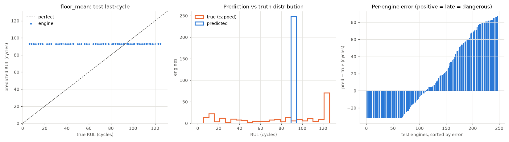
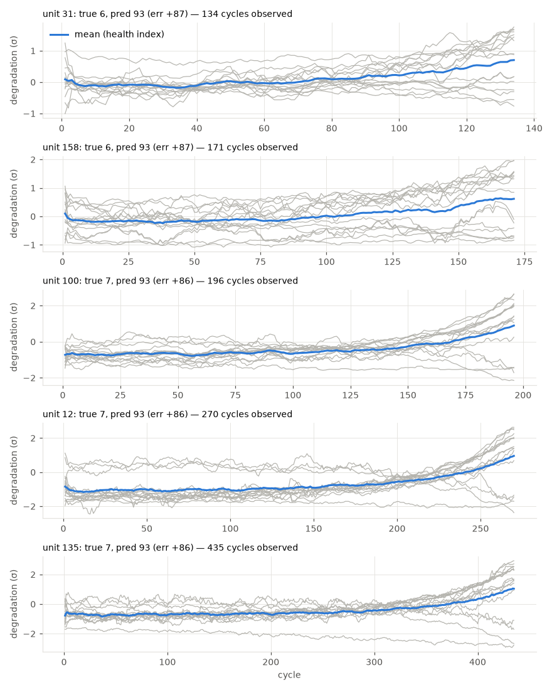

# floor_mean

RUL cap: **125**. Evaluated on the last observed cycle of each test engine (n=248).

| truth | RMSE | MAE | PHM08 score | mean bias |
|---|---|---|---|---|
| capped | 45.565 | 38.059 | 164680.7 | 15.126 |
| raw | 54.902 | 46.753 | 189682.8 | 6.433 |
| true RUL ≤ cap only (n=181) | 49.652 | 40.297 | 163961.4 | 32.576 |

**Distribution:** std ratio 0.0 (1.0 = same spread as truth), KS 0.544 (p=0.0), pred range [93.0, 93.0] vs true [6.0, 125.0].

## Error by true-RUL bucket

| bucket         |   n |   rmse |   bias |
|:---------------|----:|-------:|-------:|
| [0.0, 25.0)    |  49 |  79.44 |  79.27 |
| [25.0, 50.0)   |  30 |  56.37 |  56.05 |
| [50.0, 75.0)   |  26 |  30.36 |  29.41 |
| [75.0, 100.0)  |  41 |   9.13 |   5.55 |
| [100.0, 125.0) |  35 |  20.18 | -18.9  |
| [125.0, inf)   |  67 |  32.01 | -32.01 |

## Worst engines

|   unit |   cycles_observed |   y_true |   y_true_raw |   y_pred |   err |
|-------:|------------------:|---------:|-------------:|---------:|------:|
|     31 |               134 |        6 |            6 |       93 |    87 |
|    158 |               171 |        6 |            6 |       93 |    87 |
|    100 |               196 |        7 |            7 |       93 |    86 |
|     12 |               270 |        7 |            7 |       93 |    86 |
|    135 |               435 |        7 |            7 |       93 |    86 |

Grey lines: each informative sensor, z-scored with train-set stats, sign-flipped so up = toward failure, rolling mean over 10 cycles. Blue: their average. Sensors: s2 = Total temperature at LPC outlet (T24, °R), s3 = Total temperature at HPC outlet (T30, °R), s4 = Total temperature at LPT outlet (T50, °R), s6 = Total pressure in bypass-duct (P15, psia), s7 = Total pressure at HPC outlet (P30, psia), s8 = Physical fan speed (Nf, rpm), s9 = Physical core speed (Nc, rpm), s10 = Engine pressure ratio P50/P2 (epr), s11 = Static pressure at HPC outlet (Ps30, psia), s12 = Ratio of fuel flow to Ps30 (phi, pps/psi), s13 = Corrected fan speed (NRf, rpm), s14 = Corrected core speed (NRc, rpm), s15 = Bypass ratio (BPR), s17 = Bleed enthalpy (htBleed), s20 = HPT coolant bleed (W31, lbm/s), s21 = LPT coolant bleed (W32, lbm/s).
