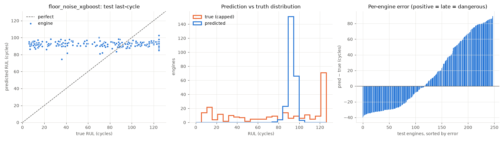
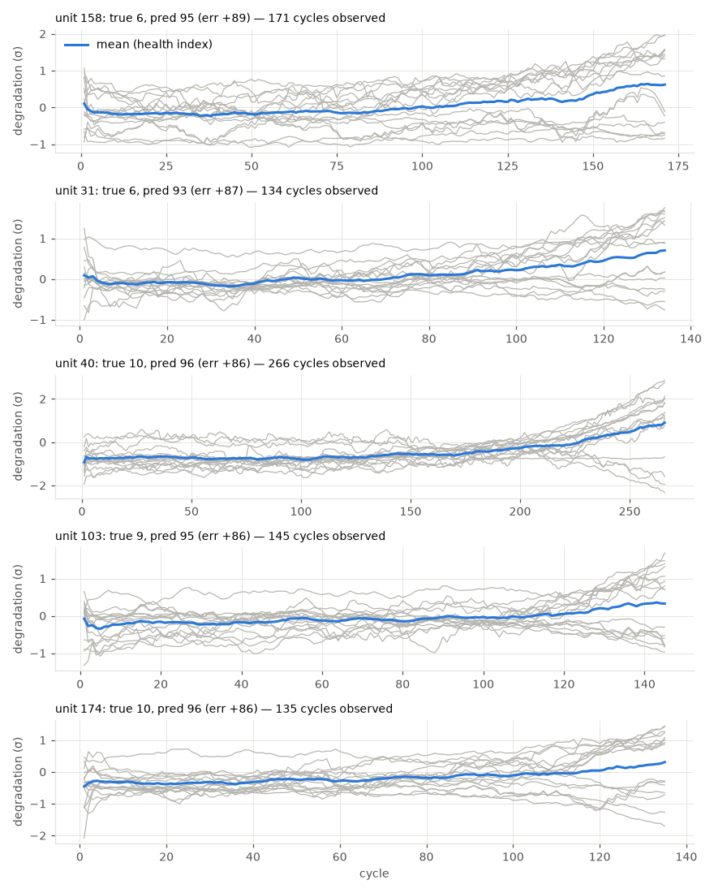

# floor_noise_xgboost

RUL cap: **125**. Evaluated on the last observed cycle of each test engine (n=248).

| truth | RMSE | MAE | PHM08 score | mean bias |
|---|---|---|---|---|
| capped | 45.247 | 37.763 | 158385.0 | 14.669 |
| raw | 54.661 | 46.456 | 184616.2 | 5.975 |
| true RUL ≤ cap only (n=181) | 49.233 | 39.925 | 157646.4 | 31.914 |

**Distribution:** std ratio 0.077 (1.0 = same spread as truth), KS 0.468 (p=0.0), pred range [74.6, 102.8] vs true [6.0, 125.0].

## Error by true-RUL bucket

| bucket         |   n |   rmse |   bias |
|:---------------|----:|-------:|-------:|
| [0.0, 25.0)    |  49 |  78.63 |  78.39 |
| [25.0, 50.0)   |  30 |  56.15 |  55.65 |
| [50.0, 75.0)   |  26 |  29.97 |  28.53 |
| [75.0, 100.0)  |  41 |   9.55 |   4.46 |
| [100.0, 125.0) |  35 |  20.07 | -18.82 |
| [125.0, inf)   |  67 |  32.09 | -31.92 |

## Worst engines

|   unit |   cycles_observed |   y_true |   y_true_raw |   y_pred |   err |
|-------:|------------------:|---------:|-------------:|---------:|------:|
|    158 |               171 |        6 |            6 |     95.3 |  89.3 |
|     31 |               134 |        6 |            6 |     92.8 |  86.8 |
|     40 |               266 |       10 |           10 |     96.1 |  86.1 |
|    103 |               145 |        9 |            9 |     94.9 |  85.9 |
|    174 |               135 |       10 |           10 |     95.7 |  85.7 |

Grey lines: each informative sensor, z-scored with train-set stats, sign-flipped so up = toward failure, rolling mean over 10 cycles. Blue: their average. Sensors: s2 = Total temperature at LPC outlet (T24, °R), s3 = Total temperature at HPC outlet (T30, °R), s4 = Total temperature at LPT outlet (T50, °R), s6 = Total pressure in bypass-duct (P15, psia), s7 = Total pressure at HPC outlet (P30, psia), s8 = Physical fan speed (Nf, rpm), s9 = Physical core speed (Nc, rpm), s10 = Engine pressure ratio P50/P2 (epr), s11 = Static pressure at HPC outlet (Ps30, psia), s12 = Ratio of fuel flow to Ps30 (phi, pps/psi), s13 = Corrected fan speed (NRf, rpm), s14 = Corrected core speed (NRc, rpm), s15 = Bypass ratio (BPR), s17 = Bleed enthalpy (htBleed), s20 = HPT coolant bleed (W31, lbm/s), s21 = LPT coolant bleed (W32, lbm/s).
