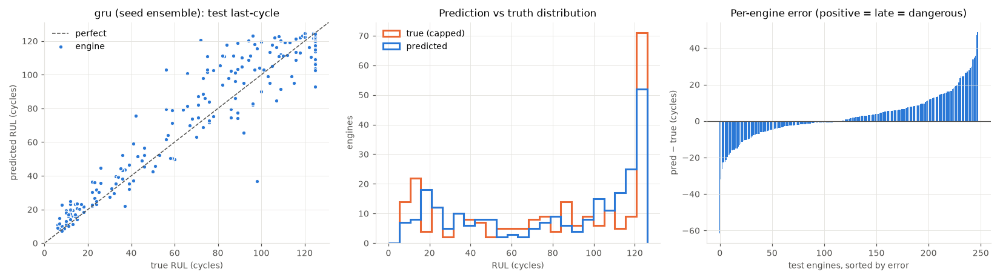
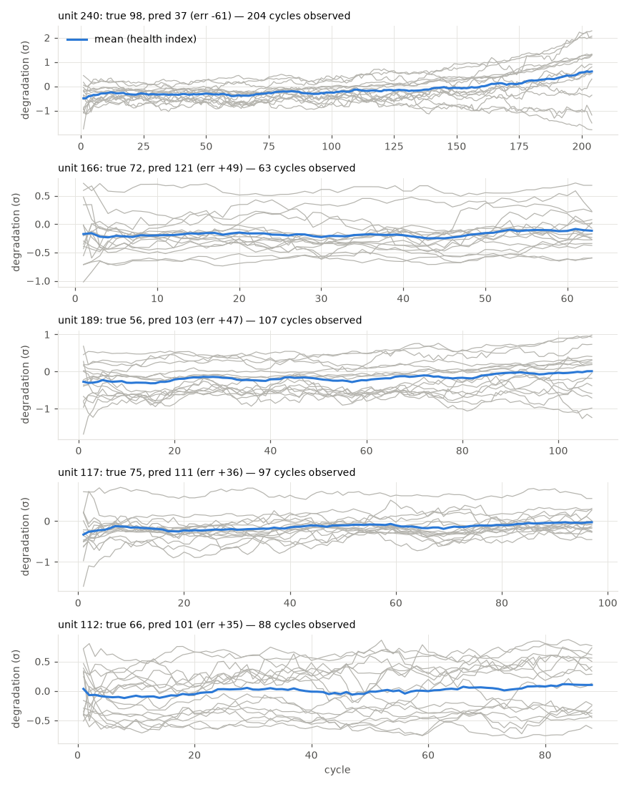

# gru (seed ensemble)

RUL cap: **125**. Evaluated on the last observed cycle of each test engine (n=248).

| truth | RMSE | MAE | PHM08 score | mean bias |
|---|---|---|---|---|
| capped | 12.864 | 8.894 | 911.0 | 2.65 |
| raw | 25.005 | 17.587 | 4193.0 | -6.043 |
| true RUL ≤ cap only (n=181) | 14.071 | 10.129 | 853.8 | 5.688 |

**Distribution:** std ratio 0.955 (1.0 = same spread as truth), KS 0.27 (p=0.0), pred range [7.4, 124.7] vs true [6.0, 125.0].

## Error by true-RUL bucket

| bucket         |   n |   rmse |   bias |
|:---------------|----:|-------:|-------:|
| [0.0, 25.0)    |  49 |   6.21 |   4.64 |
| [25.0, 50.0)   |  30 |  10.28 |   5.17 |
| [50.0, 75.0)   |  26 |  18.91 |  10.44 |
| [75.0, 100.0)  |  41 |  20.97 |   8.95 |
| [100.0, 125.0) |  35 |   9.92 |   0.26 |
| [125.0, inf)   |  67 |   8.81 |  -5.56 |

## Worst engines

|   unit |   cycles_observed |   y_true |   y_true_raw |   y_pred |   err |
|-------:|------------------:|---------:|-------------:|---------:|------:|
|    240 |               204 |       98 |           98 |     36.6 | -61.4 |
|    166 |                63 |       72 |           72 |    120.7 |  48.7 |
|    189 |               107 |       56 |           56 |    103   |  47   |
|    117 |                97 |       75 |           75 |    110.9 |  35.9 |
|    112 |                88 |       66 |           66 |    100.8 |  34.8 |





Grey lines: each informative sensor, z-scored with train-set stats, sign-flipped so up = toward failure, rolling mean over 10 cycles. Blue: their average. Sensors: s2 = Total temperature at LPC outlet (T24, °R), s3 = Total temperature at HPC outlet (T30, °R), s4 = Total temperature at LPT outlet (T50, °R), s6 = Total pressure in bypass-duct (P15, psia), s7 = Total pressure at HPC outlet (P30, psia), s8 = Physical fan speed (Nf, rpm), s9 = Physical core speed (Nc, rpm), s10 = Engine pressure ratio P50/P2 (epr), s11 = Static pressure at HPC outlet (Ps30, psia), s12 = Ratio of fuel flow to Ps30 (phi, pps/psi), s13 = Corrected fan speed (NRf, rpm), s14 = Corrected core speed (NRc, rpm), s15 = Bypass ratio (BPR), s17 = Bleed enthalpy (htBleed), s20 = HPT coolant bleed (W31, lbm/s), s21 = LPT coolant bleed (W32, lbm/s).

## Run details

```json
{
  "per_seed_test_rmse": [
    13.554,
    13.975,
    12.928,
    13.824,
    13.815
  ],
  "seed_mean": 13.619,
  "seed_std": 0.371,
  "window": 30,
  "config": {
    "arch": "gru",
    "d_model": 64,
    "n_layers": 2,
    "dropout": 0.1,
    "lr": 0.001,
    "weight_decay": 0.0001,
    "batch": 256,
    "epochs": 60,
    "warmup": 2,
    "cosine": true,
    "patience": 0,
    "input_noise": 0.0
  },
  "features": [
    "s2",
    "s3",
    "s4",
    "s6",
    "s7",
    "s8",
    "s9",
    "s10",
    "s11",
    "s12",
    "s13",
    "s14",
    "s15",
    "s17",
    "s20",
    "s21",
    "age"
  ],
  "training": [
    {
      "val_rmse": [
        17.703,
        16.755,
        16.745,
        17.57,
        16.602,
        16.939,
        16.92,
        16.713,
        17.377,
        16.778,
        16.855,
        16.856,
        16.459,
        17.244,
        17.384,
        17.692,
        18.025,
        17.77,
        17.884,
        17.302,
        17.389,
        18.086,
        17.369,
        18.544,
        18.028,
        18.185,
        17.992,
        17.465,
        17.737,
        17.551,
        18.0,
        18.273,
        17.934,
        17.786,
        18.015,
        17.781,
        17.8,
        17.566,
        17.649,
        17.75,
        18.012,
        18.143,
        18.404,
        18.04,
        17.781,
        18.005,
        17.946,
        18.126,
        17.91,
        17.933,
        18.133,
        18.007,
        18.128,
        18.03,
        18.071,
        18.069,
        18.073,
        18.08,
        18.058,
        18.056
      ],
      "best_epoch": 12,
      "train_rmse": [
        39.649,
        16.046,
        14.28,
        13.05,
        12.624,
        12.091,
        11.719,
        11.386,
        11.08,
        10.798,
        10.664,
        10.278,
        10.084,
        9.718,
        9.371,
        9.096,
        8.831,
        8.528,
        8.309,
        8.066,
        7.771,
        7.568,
        7.328,
        7.096,
        6.919,
        6.729,
        6.561,
        6.439,
        6.212,
        6.089,
        5.983,
        5.826,
        5.73,
        5.572,
        5.494,
        5.378,
        5.254,
        5.214,
        5.091,
        5.024,
        4.935,
        4.875,
        4.836,
        4.757,
        4.721,
        4.68,
        4.639,
        4.592,
        4.571,
        4.532,
        4.495,
        4.478,
        4.453,
        4.433,
        4.401,
        4.404,
        4.374,
        4.386,
        4.385,
        4.407
      ],
      "seconds": 871
    },
    {
      "val_rmse": [
        15.53,
        14.891,
        14.532,
        14.267,
        13.855,
        13.523,
        13.767,
        12.99,
        12.892,
        12.768,
        14.554,
        13.402,
        13.517,
        12.86,
        14.664,
        13.919,
        13.799,
        14.665,
        14.228,
        14.538,
        14.091,
        13.768,
        14.704,
        14.839,
        14.947,
        14.579,
        14.905,
        14.13,
        14.795,
        14.564,
        15.102,
        14.487,
        14.5,
        14.713,
        14.427,
        14.572,
        14.498,
        14.889,
        14.539,
        14.71,
        14.561,
        14.583,
        14.642,
        14.744,
        14.79,
        14.569,
        14.619,
        14.849,
        14.473,
        14.762,
        14.792,
        14.741,
        14.731,
        14.79,
        14.755,
        14.758,
        14.825,
        14.812,
        14.765,
        14.765
      ],
      "best_epoch": 9,
      "train_rmse": [
        35.388,
        16.793,
        14.585,
        13.568,
        13.113,
        12.671,
        12.389,
        12.052,
        11.726,
        11.469,
        11.253,
        11.015,
        10.71,
        10.38,
        10.004,
        9.674,
        9.299,
        8.832,
        8.395,
        8.065,
        7.701,
        7.396,
        7.131,
        6.914,
        6.675,
        6.496,
        6.315,
        6.131,
        5.997,
        5.782,
        5.65,
        5.528,
        5.426,
        5.276,
        5.184,
        5.081,
        4.989,
        4.938,
        4.825,
        4.753,
        4.669,
        4.622,
        4.543,
        4.495,
        4.442,
        4.395,
        4.371,
        4.322,
        4.273,
        4.254,
        4.235,
        4.198,
        4.172,
        4.16,
        4.144,
        4.141,
        4.132,
        4.127,
        4.117,
        4.118
      ],
      "seconds": 846
    },
    {
      "val_rmse": [
        19.925,
        18.342,
        17.162,
        16.968,
        16.253,
        16.869,
        16.163,
        16.31,
        16.396,
        16.672,
        16.863,
        16.686,
        16.39,
        16.437,
        17.542,
        16.882,
        16.806,
        16.894,
        17.371,
        17.362,
        17.557,
        18.151,
        17.714,
        17.961,
        17.832,
        18.147,
        18.109,
        18.129,
        17.992,
        18.514,
        18.181,
        17.947,
        18.018,
        18.207,
        18.025,
        17.97,
        18.257,
        17.991,
        18.205,
        18.218,
        18.253,
        18.397,
        18.527,
        18.483,
        18.378,
        18.514,
        18.465,
        18.326,
        18.341,
        18.363,
        18.364,
        18.489,
        18.419,
        18.392,
        18.44,
        18.459,
        18.425,
        18.435,
        18.451,
        18.443
      ],
      "best_epoch": 6,
      "train_rmse": [
        40.303,
        15.353,
        13.996,
        13.147,
        12.565,
        12.195,
        11.937,
        11.626,
        11.501,
        11.129,
        10.927,
        10.641,
        10.289,
        10.062,
        9.667,
        9.383,
        8.958,
        8.58,
        8.321,
        8.041,
        7.606,
        7.329,
        7.105,
        6.792,
        6.561,
        6.406,
        6.249,
        6.014,
        5.858,
        5.656,
        5.552,
        5.447,
        5.273,
        5.193,
        5.076,
        4.999,
        4.902,
        4.793,
        4.767,
        4.697,
        4.597,
        4.555,
        4.491,
        4.466,
        4.413,
        4.341,
        4.318,
        4.287,
        4.257,
        4.21,
        4.192,
        4.181,
        4.158,
        4.144,
        4.116,
        4.105,
        4.093,
        4.099,
        4.095,
        4.098
      ],
      "seconds": 856
    },
    {
      "val_rmse": [
        17.933,
        15.206,
        13.5,
        13.304,
        13.312,
        13.113,
        13.151,
        13.653,
        13.484,
        13.932,
        13.744,
        14.322,
        14.63,
        14.458,
        14.986,
        15.605,
        16.029,
        14.931,
        15.83,
        14.857,
        15.045,
        15.213,
        16.203,
        15.345,
        14.981,
        15.156,
        15.125,
        15.918,
        15.915,
        15.474,
        15.64,
        15.45,
        15.526,
        15.861,
        15.84,
        15.664,
        15.249,
        15.751,
        15.696,
        15.324,
        15.8,
        15.6,
        15.459,
        15.437,
        15.419,
        15.707,
        15.809,
        15.663,
        15.691,
        15.747,
        15.511,
        15.6,
        15.419,
        15.537,
        15.601,
        15.513,
        15.473,
        15.566,
        15.516,
        15.511
      ],
      "best_epoch": 5,
      "train_rmse": [
        37.083,
        16.65,
        14.675,
        13.469,
        13.127,
        12.73,
        12.421,
        12.226,
        11.812,
        11.51,
        11.453,
        11.08,
        10.711,
        10.356,
        9.912,
        9.557,
        9.252,
        8.859,
        8.542,
        8.209,
        7.945,
        7.668,
        7.406,
        7.145,
        7.002,
        6.812,
        6.575,
        6.457,
        6.296,
        6.119,
        6.039,
        5.811,
        5.704,
        5.585,
        5.44,
        5.335,
        5.236,
        5.15,
        5.044,
        4.962,
        4.838,
        4.805,
        4.73,
        4.671,
        4.625,
        4.58,
        4.541,
        4.498,
        4.434,
        4.414,
        4.395,
        4.365,
        4.36,
        4.337,
        4.323,
        4.298,
        4.295,
        4.3,
        4.285,
        4.285
      ],
      "seconds": 859
    },
    {
      "val_rmse": [
        16.354,
        14.345,
        13.688,
        13.832,
        14.041,
        13.08,
        12.756,
        13.837,
        13.314,
        13.183,
        13.189,
        13.259,
        13.194,
        13.383,
        13.579,
        14.249,
        13.687,
        14.249,
        14.68,
        13.631,
        14.051,
        14.022,
        14.316,
        14.156,
        14.292,
        14.132,
        14.324,
        14.483,
        14.083,
        14.721,
        14.513,
        14.512,
        14.478,
        14.436,
        14.589,
        14.314,
        14.933,
        14.713,
        14.588,
        14.5,
        14.528,
        14.548,
        14.706,
        14.644,
        14.423,
        14.687,
        14.637,
        14.621,
        14.649,
        14.542,
        14.709,
        14.712,
        14.616,
        14.612,
        14.574,
        14.601,
        14.614,
        14.596,
        14.609,
        14.606
      ],
      "best_epoch": 6,
      "train_rmse": [
        33.349,
        16.173,
        14.307,
        13.414,
        12.902,
        12.584,
        12.345,
        12.116,
        11.788,
        11.552,
        11.341,
        11.02,
        10.859,
        10.542,
        10.3,
        9.831,
        9.378,
        8.865,
        8.487,
        8.156,
        7.801,
        7.564,
        7.333,
        7.045,
        6.777,
        6.59,
        6.416,
        6.211,
        6.054,
        5.926,
        5.822,
        5.651,
        5.509,
        5.389,
        5.25,
        5.129,
        5.044,
        4.978,
        4.91,
        4.824,
        4.773,
        4.68,
        4.621,
        4.576,
        4.532,
        4.472,
        4.424,
        4.395,
        4.347,
        4.315,
        4.289,
        4.289,
        4.256,
        4.241,
        4.2,
        4.219,
        4.179,
        4.178,
        4.204,
        4.176
      ],
      "seconds": 865
    }
  ]
}
```
