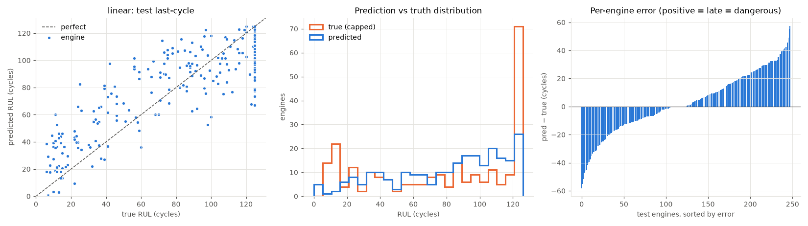
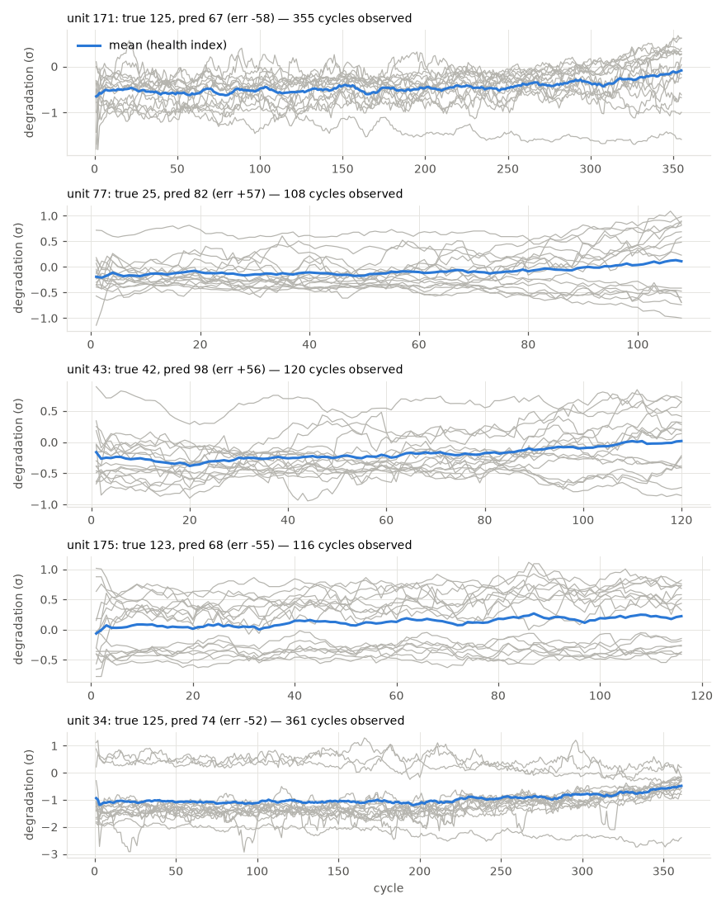

# linear

RUL cap: **125**. Evaluated on the last observed cycle of each test engine (n=248).

| truth | RMSE | MAE | PHM08 score | mean bias |
|---|---|---|---|---|
| capped | 21.931 | 17.252 | 2871.5 | 2.755 |
| raw | 32.992 | 25.945 | 10074.4 | -5.939 |
| true RUL ≤ cap only (n=181) | 22.022 | 17.934 | 2422.9 | 9.478 |

**Distribution:** std ratio 0.791 (1.0 = same spread as truth), KS 0.202 (p=0.0001), pred range [0.0, 125.0] vs true [6.0, 125.0].

## Error by true-RUL bucket

| bucket         |   n |   rmse |   bias |
|:---------------|----:|-------:|-------:|
| [0.0, 25.0)    |  49 |  21.99 |  16.41 |
| [25.0, 50.0)   |  30 |  26.95 |  20.44 |
| [50.0, 75.0)   |  26 |  24.31 |  16.29 |
| [75.0, 100.0)  |  41 |  18.8  |   6.37 |
| [100.0, 125.0) |  35 |  18.85 | -11.04 |
| [125.0, inf)   |  67 |  21.68 | -15.41 |

## Worst engines

|   unit |   cycles_observed |   y_true |   y_true_raw |   y_pred |   err |
|-------:|------------------:|---------:|-------------:|---------:|------:|
|    171 |               355 |      125 |          126 |     66.9 | -58.1 |
|     77 |               108 |       25 |           25 |     82.4 |  57.4 |
|     43 |               120 |       42 |           42 |     97.5 |  55.5 |
|    175 |               116 |      123 |          123 |     67.8 | -55.2 |
|     34 |               361 |      125 |          126 |     73.5 | -51.5 |





Grey lines: each informative sensor, z-scored with train-set stats, sign-flipped so up = toward failure, rolling mean over 10 cycles. Blue: their average. Sensors: s2 = Total temperature at LPC outlet (T24, °R), s3 = Total temperature at HPC outlet (T30, °R), s4 = Total temperature at LPT outlet (T50, °R), s6 = Total pressure in bypass-duct (P15, psia), s7 = Total pressure at HPC outlet (P30, psia), s8 = Physical fan speed (Nf, rpm), s9 = Physical core speed (Nc, rpm), s10 = Engine pressure ratio P50/P2 (epr), s11 = Static pressure at HPC outlet (Ps30, psia), s12 = Ratio of fuel flow to Ps30 (phi, pps/psi), s13 = Corrected fan speed (NRf, rpm), s14 = Corrected core speed (NRc, rpm), s15 = Bypass ratio (BPR), s17 = Bleed enthalpy (htBleed), s20 = HPT coolant bleed (W31, lbm/s), s21 = LPT coolant bleed (W32, lbm/s).

## Run details

```json
{
  "cv_rmse_mean": 20.363,
  "cv_rmse_std": 1.052,
  "cv_rmse_folds": [
    21.87,
    20.48,
    19.35,
    19.05,
    21.05
  ],
  "features": [
    "cycle",
    "s2_last",
    "s2_mean",
    "s2_std",
    "s2_slope",
    "s3_last",
    "s3_mean",
    "s3_std",
    "s3_slope",
    "s4_last",
    "s4_mean",
    "s4_std",
    "s4_slope",
    "s6_last",
    "s6_mean",
    "s6_std",
    "s6_slope",
    "s7_last",
    "s7_mean",
    "s7_std",
    "s7_slope",
    "s8_last",
    "s8_mean",
    "s8_std",
    "s8_slope",
    "s9_last",
    "s9_mean",
    "s9_std",
    "s9_slope",
    "s10_last",
    "s10_mean",
    "s10_std",
    "s10_slope",
    "s11_last",
    "s11_mean",
    "s11_std",
    "s11_slope",
    "s12_last",
    "s12_mean",
    "s12_std",
    "s12_slope",
    "s13_last",
    "s13_mean",
    "s13_std",
    "s13_slope",
    "s14_last",
    "s14_mean",
    "s14_std",
    "s14_slope",
    "s15_last",
    "s15_mean",
    "s15_std",
    "s15_slope",
    "s17_last",
    "s17_mean",
    "s17_std",
    "s17_slope",
    "s20_last",
    "s20_mean",
    "s20_std",
    "s20_slope",
    "s21_last",
    "s21_mean",
    "s21_std",
    "s21_slope"
  ]
}
```
