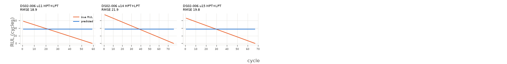

# floor_mean

Uncapped RUL, every test cycle (n=202 cycles, 3 engines).

**RMSE 20.381**, MAE 17.433, mean bias 3.684, std ratio 0.0.

## By subset

| subset   |   engines |   cycles |   rmse |   bias |
|:---------|----------:|---------:|-------:|-------:|
| DS02-006 |         3 |      202 |  20.38 |   3.68 |

## By components

| components   |   engines |   cycles |   rmse |   bias |
|:-------------|----------:|---------:|-------:|-------:|
| HPT+LPT      |         3 |      202 |  20.38 |   3.68 |

## By Fc

|   Fc |   engines |   cycles |   rmse |   bias |
|-----:|----------:|---------:|-------:|-------:|
|    1 |         1 |       76 |  21.94 |  -0.29 |
|    2 |         1 |       67 |  19.79 |   4.21 |
|    3 |         1 |       59 |  18.9  |   8.21 |

## Worst engines

|                                |   engines |   cycles |   rmse |   bias |
|:-------------------------------|----------:|---------:|-------:|-------:|
| ('DS02-006', 14, 'HPT+LPT', 1) |         1 |       76 |  21.94 |  -0.29 |
| ('DS02-006', 15, 'HPT+LPT', 2) |         1 |       67 |  19.79 |   4.21 |
| ('DS02-006', 11, 'HPT+LPT', 3) |         1 |       59 |  18.9  |   8.21 |

