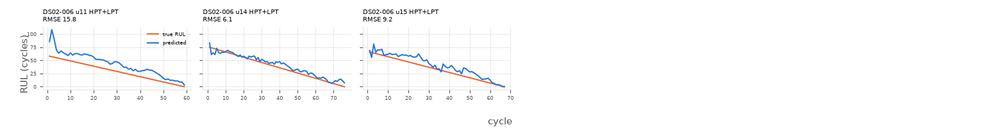

# linear

Uncapped RUL, every test cycle (n=202 cycles, 3 engines).

**RMSE 10.698**, MAE 8.639, mean bias 7.974, std ratio 1.038.

## By subset

| subset   |   engines |   cycles |   rmse |   bias |
|:---------|----------:|---------:|-------:|-------:|
| DS02-006 |         3 |      202 |   10.7 |   7.97 |

## By components

| components   |   engines |   cycles |   rmse |   bias |
|:-------------|----------:|---------:|-------:|-------:|
| HPT+LPT      |         3 |      202 |   10.7 |   7.97 |

## By Fc

|   Fc |   engines |   cycles |   rmse |   bias |
|-----:|----------:|---------:|-------:|-------:|
|    1 |         1 |       76 |   6.06 |   3.69 |
|    2 |         1 |       67 |   9.2  |   7.46 |
|    3 |         1 |       59 |  15.76 |  14.07 |

## Worst engines

|                                |   engines |   cycles |   rmse |   bias |
|:-------------------------------|----------:|---------:|-------:|-------:|
| ('DS02-006', 11, 'HPT+LPT', 3) |         1 |       59 |  15.76 |  14.07 |
| ('DS02-006', 15, 'HPT+LPT', 2) |         1 |       67 |   9.2  |   7.46 |
| ('DS02-006', 14, 'HPT+LPT', 1) |         1 |       76 |   6.06 |   3.69 |



```json
{
  "cv_rmse_mean": 9.439,
  "cv_rmse_std": 2.364
}
```
