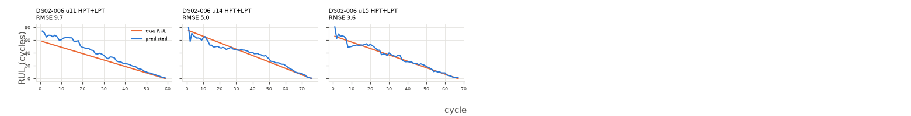

# xgboost

Uncapped RUL, every test cycle (n=202 cycles, 3 engines).

**RMSE 6.424**, MAE 4.71, mean bias 2.561, std ratio 1.015.

## By subset

| subset   |   engines |   cycles |   rmse |   bias |
|:---------|----------:|---------:|-------:|-------:|
| DS02-006 |         3 |      202 |   6.42 |   2.56 |

## By components

| components   |   engines |   cycles |   rmse |   bias |
|:-------------|----------:|---------:|-------:|-------:|
| HPT+LPT      |         3 |      202 |   6.42 |   2.56 |

## By Fc

|   Fc |   engines |   cycles |   rmse |   bias |
|-----:|----------:|---------:|-------:|-------:|
|    1 |         1 |       76 |   4.99 |  -0.18 |
|    2 |         1 |       67 |   3.59 |   0.86 |
|    3 |         1 |       59 |   9.72 |   8.02 |

## Worst engines

|                                |   engines |   cycles |   rmse |   bias |
|:-------------------------------|----------:|---------:|-------:|-------:|
| ('DS02-006', 11, 'HPT+LPT', 3) |         1 |       59 |   9.72 |   8.02 |
| ('DS02-006', 14, 'HPT+LPT', 1) |         1 |       76 |   4.99 |  -0.18 |
| ('DS02-006', 15, 'HPT+LPT', 2) |         1 |       67 |   3.59 |   0.86 |



```json
{
  "cv_rmse_mean": 6.762,
  "cv_rmse_std": 2.037
}
```
