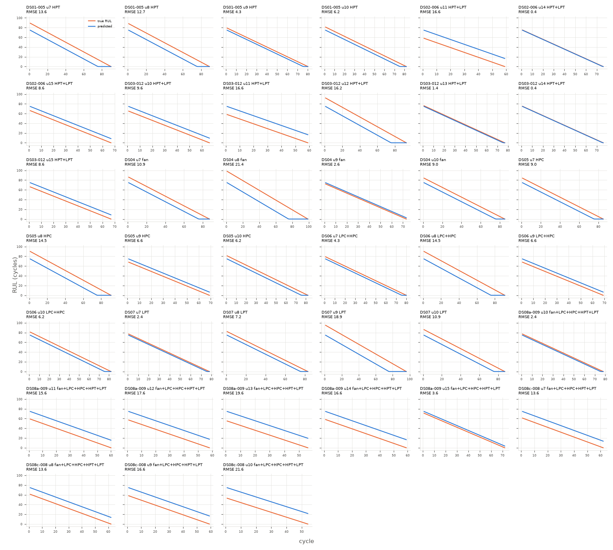

# floor_lifetime

Uncapped RUL, every test cycle (n=2938 cycles, 39 engines).

**RMSE 11.895**, MAE 10.102, mean bias -1.285, std ratio 0.96.

## By subset

| subset    |   engines |   cycles |   rmse |   bias |
|:----------|----------:|---------:|-------:|-------:|
| DS01-005  |         4 |      341 |  10.22 |  -9.17 |
| DS02-006  |         3 |      202 |  10.24 |   7.54 |
| DS03-012  |         6 |      438 |  10.89 |   1.34 |
| DS04      |         4 |      344 |  13.55 | -10.22 |
| DS05      |         4 |      327 |   9.92 |  -6.35 |
| DS06      |         4 |      322 |   9.11 |  -5.17 |
| DS07      |         4 |      344 |  11.95 |  -9.98 |
| DS08a-009 |         6 |      383 |  13.67 |  10.71 |
| DS08c-008 |         4 |      237 |  16.47 |  16.15 |

## By components

| components          |   engines |   cycles |   rmse |   bias |
|:--------------------|----------:|---------:|-------:|-------:|
| HPC                 |         4 |      327 |   9.92 |  -6.35 |
| HPT                 |         4 |      341 |  10.22 |  -9.17 |
| HPT+LPT             |         9 |      640 |  10.69 |   3.3  |
| LPC+HPC             |         4 |      322 |   9.11 |  -5.17 |
| LPT                 |         4 |      344 |  11.95 |  -9.98 |
| fan                 |         4 |      344 |  13.55 | -10.22 |
| fan+LPC+HPC+HPT+LPT |        10 |      620 |  14.8  |  12.79 |

## By Fc

|   Fc |   engines |   cycles |   rmse |   bias |
|-----:|----------:|---------:|-------:|-------:|
|    1 |        13 |     1081 |   9.76 |  -7.44 |
|    2 |        14 |     1022 |  12.83 |   0.76 |
|    3 |        12 |      835 |  13.16 |   4.18 |

## Worst engines

|                                             |   engines |   cycles |   rmse |   bias |
|:--------------------------------------------|----------:|---------:|-------:|-------:|
| ('DS08c-008', 10, 'fan+LPC+HPC+HPT+LPT', 2) |         1 |       54 |  21.58 |  21.58 |
| ('DS04', 8, 'fan', 2)                       |         1 |       99 |  21.43 | -20.53 |
| ('DS08a-009', 13, 'fan+LPC+HPC+HPT+LPT', 3) |         1 |       56 |  19.58 |  19.58 |
| ('DS07', 9, 'LPT', 3)                       |         1 |       96 |  18.86 | -18.14 |
| ('DS08a-009', 12, 'fan+LPC+HPC+HPT+LPT', 3) |         1 |       58 |  17.58 |  17.58 |
| ('DS03-012', 11, 'HPT+LPT', 3)              |         1 |       59 |  16.58 |  16.58 |
| ('DS02-006', 11, 'HPT+LPT', 3)              |         1 |       59 |  16.58 |  16.58 |
| ('DS08c-008', 9, 'fan+LPC+HPC+HPT+LPT', 2)  |         1 |       59 |  16.58 |  16.58 |

