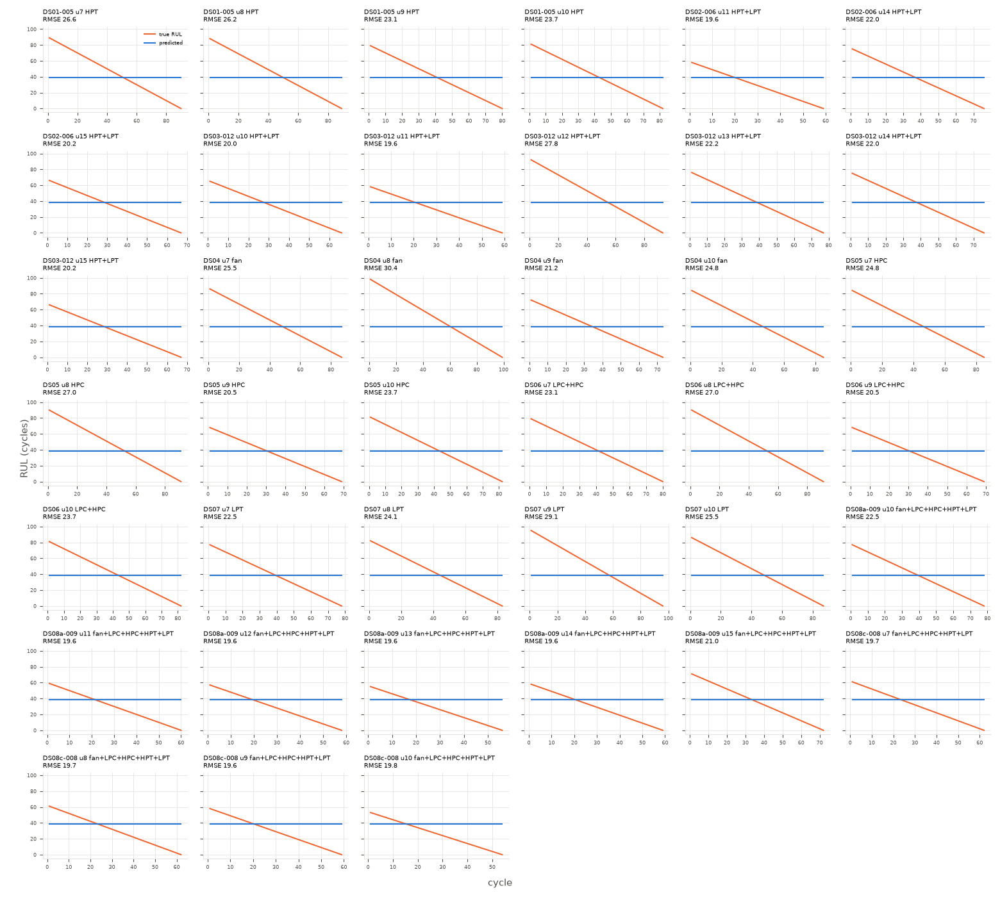

# floor_mean

Uncapped RUL, every test cycle (n=2938 cycles, 39 engines).

**RMSE 23.427**, MAE 19.887, mean bias 0.483, std ratio 0.0.

## By subset

| subset    |   engines |   cycles |   rmse |   bias |
|:----------|----------:|---------:|-------:|-------:|
| DS01-005  |         4 |      341 |  25.05 |  -3.56 |
| DS02-006  |         3 |      202 |  20.7  |   5.15 |
| DS03-012  |         6 |      438 |  22.57 |   1.87 |
| DS04      |         4 |      344 |  26.02 |  -4.32 |
| DS05      |         4 |      327 |  24.33 |  -2.1  |
| DS06      |         4 |      322 |  23.92 |  -1.46 |
| DS07      |         4 |      344 |  25.59 |  -4.08 |
| DS08a-009 |         6 |      383 |  20.5  |   6.73 |
| DS08c-008 |         4 |      237 |  19.68 |   9.46 |

## By components

| components          |   engines |   cycles |   rmse |   bias |
|:--------------------|----------:|---------:|-------:|-------:|
| HPC                 |         4 |      327 |  24.33 |  -2.1  |
| HPT                 |         4 |      341 |  25.05 |  -3.56 |
| HPT+LPT             |         9 |      640 |  21.99 |   2.9  |
| LPC+HPC             |         4 |      322 |  23.92 |  -1.46 |
| LPT                 |         4 |      344 |  25.59 |  -4.08 |
| fan                 |         4 |      344 |  26.02 |  -4.32 |
| fan+LPC+HPC+HPT+LPT |        10 |      620 |  20.19 |   7.77 |

## By Fc

|   Fc |   engines |   cycles |   rmse |   bias |
|-----:|----------:|---------:|-------:|-------:|
|    1 |        13 |     1081 |  24.58 |  -2.66 |
|    2 |        14 |     1022 |  23.11 |   1.51 |
|    3 |        12 |      835 |  22.26 |   3.3  |

## Worst engines

|                                |   engines |   cycles |   rmse |   bias |
|:-------------------------------|----------:|---------:|-------:|-------:|
| ('DS04', 8, 'fan', 2)          |         1 |       99 |  30.39 | -10.33 |
| ('DS07', 9, 'LPT', 3)          |         1 |       96 |  29.08 |  -8.83 |
| ('DS03-012', 12, 'HPT+LPT', 1) |         1 |       93 |  27.83 |  -7.33 |
| ('DS06', 8, 'LPC+HPC', 1)      |         1 |       91 |  27.02 |  -6.33 |
| ('DS05', 8, 'HPC', 1)          |         1 |       91 |  27.02 |  -6.33 |
| ('DS01-005', 7, 'HPT', 1)      |         1 |       90 |  26.62 |  -5.83 |
| ('DS01-005', 8, 'HPT', 2)      |         1 |       89 |  26.24 |  -5.33 |
| ('DS07', 10, 'LPT', 1)         |         1 |       87 |  25.48 |  -4.33 |

