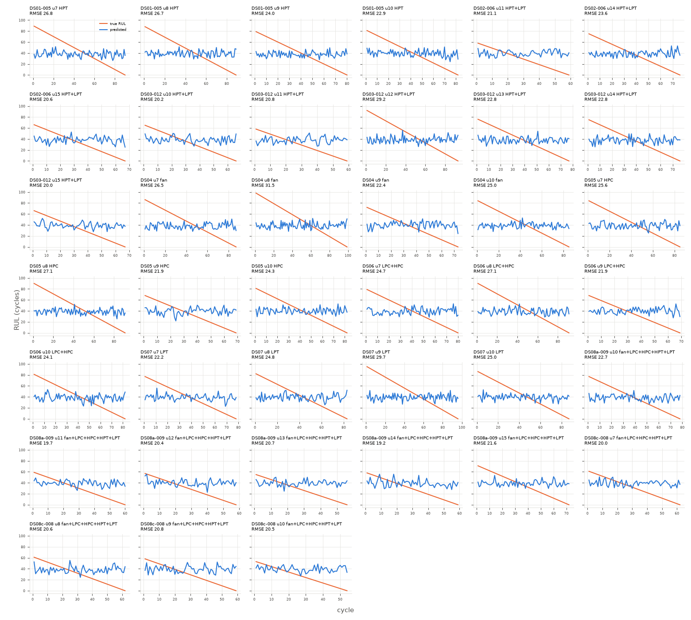

# floor_noise_xgboost

Uncapped RUL, every test cycle (n=2938 cycles, 39 engines).

**RMSE 24.018**, MAE 20.238, mean bias 0.64, std ratio 0.227.

## By subset

| subset    |   engines |   cycles |   rmse |   bias |
|:----------|----------:|---------:|-------:|-------:|
| DS01-005  |         4 |      341 |  25.21 |  -3.72 |
| DS02-006  |         3 |      202 |  21.89 |   5.29 |
| DS03-012  |         6 |      438 |  23.3  |   1.41 |
| DS04      |         4 |      344 |  26.93 |  -4.1  |
| DS05      |         4 |      327 |  24.95 |  -1.65 |
| DS06      |         4 |      322 |  24.68 |  -1.12 |
| DS07      |         4 |      344 |  25.77 |  -3.57 |
| DS08a-009 |         6 |      383 |  20.87 |   7.09 |
| DS08c-008 |         4 |      237 |  20.46 |   9.65 |

## By components

| components          |   engines |   cycles |   rmse |   bias |
|:--------------------|----------:|---------:|-------:|-------:|
| HPC                 |         4 |      327 |  24.95 |  -1.65 |
| HPT                 |         4 |      341 |  25.21 |  -3.72 |
| HPT+LPT             |         9 |      640 |  22.86 |   2.64 |
| LPC+HPC             |         4 |      322 |  24.68 |  -1.12 |
| LPT                 |         4 |      344 |  25.77 |  -3.57 |
| fan                 |         4 |      344 |  26.93 |  -4.1  |
| fan+LPC+HPC+HPT+LPT |        10 |      620 |  20.71 |   8.07 |

## By Fc

|   Fc |   engines |   cycles |   rmse |   bias |
|-----:|----------:|---------:|-------:|-------:|
|    1 |        13 |     1081 |  25.08 |  -2.68 |
|    2 |        14 |     1022 |  23.82 |   1.71 |
|    3 |        12 |      835 |  22.84 |   3.63 |

## Worst engines

|                                |   engines |   cycles |   rmse |   bias |
|:-------------------------------|----------:|---------:|-------:|-------:|
| ('DS04', 8, 'fan', 2)          |         1 |       99 |  31.5  | -10.11 |
| ('DS07', 9, 'LPT', 3)          |         1 |       96 |  29.66 |  -8.35 |
| ('DS03-012', 12, 'HPT+LPT', 1) |         1 |       93 |  29.2  |  -7.51 |
| ('DS06', 8, 'LPC+HPC', 1)      |         1 |       91 |  27.08 |  -6.2  |
| ('DS05', 8, 'HPC', 1)          |         1 |       91 |  27.06 |  -6.39 |
| ('DS01-005', 7, 'HPT', 1)      |         1 |       90 |  26.78 |  -6.44 |
| ('DS01-005', 8, 'HPT', 2)      |         1 |       89 |  26.65 |  -4.99 |
| ('DS04', 7, 'fan', 2)          |         1 |       87 |  26.54 |  -5.04 |

