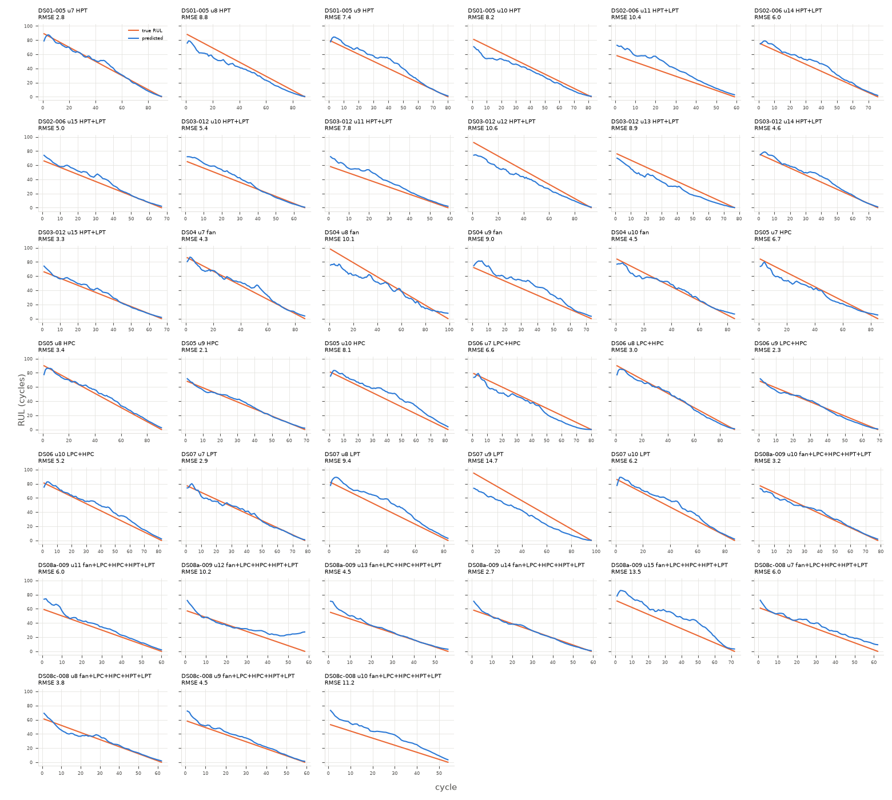

# gru (seed ensemble)

Uncapped RUL, every test cycle (n=2938 cycles, 39 engines).

**RMSE 7.297**, MAE 5.572, mean bias 0.901, std ratio 0.971.

## By subset

| subset    |   engines |   cycles |   rmse |   bias |
|:----------|----------:|---------:|-------:|-------:|
| DS01-005  |         4 |      341 |   7.13 |  -2.23 |
| DS02-006  |         3 |      202 |   7.33 |   5.94 |
| DS03-012  |         6 |      438 |   7.48 |  -1.02 |
| DS04      |         4 |      344 |   7.51 |   0.01 |
| DS05      |         4 |      327 |   5.69 |   1.17 |
| DS06      |         4 |      322 |   4.6  |  -1.05 |
| DS07      |         4 |      344 |   9.66 |  -0.61 |
| DS08a-009 |         6 |      383 |   7.87 |   4.47 |
| DS08c-008 |         4 |      237 |   6.84 |   4.66 |

## By components

| components          |   engines |   cycles |   rmse |   bias |
|:--------------------|----------:|---------:|-------:|-------:|
| HPC                 |         4 |      327 |   5.69 |   1.17 |
| HPT                 |         4 |      341 |   7.13 |  -2.23 |
| HPT+LPT             |         9 |      640 |   7.43 |   1.18 |
| LPC+HPC             |         4 |      322 |   4.6  |  -1.05 |
| LPT                 |         4 |      344 |   9.66 |  -0.61 |
| fan                 |         4 |      344 |   7.51 |   0.01 |
| fan+LPC+HPC+HPT+LPT |        10 |      620 |   7.49 |   4.54 |

## By Fc

|   Fc |   engines |   cycles |   rmse |   bias |
|-----:|----------:|---------:|-------:|-------:|
|    1 |        13 |     1081 |   7.06 |   2.99 |
|    2 |        14 |     1022 |   6.86 |   0.23 |
|    3 |        12 |      835 |   8.08 |  -0.99 |

## Worst engines

|                                             |   engines |   cycles |   rmse |   bias |
|:--------------------------------------------|----------:|---------:|-------:|-------:|
| ('DS07', 9, 'LPT', 3)                       |         1 |       96 |  14.75 | -13.78 |
| ('DS08a-009', 15, 'fan+LPC+HPC+HPT+LPT', 1) |         1 |       72 |  13.46 |  12.43 |
| ('DS08c-008', 10, 'fan+LPC+HPC+HPT+LPT', 2) |         1 |       54 |  11.21 |  10.69 |
| ('DS03-012', 12, 'HPT+LPT', 1)              |         1 |       93 |  10.65 |  -9.36 |
| ('DS02-006', 11, 'HPT+LPT', 3)              |         1 |       59 |  10.42 |   9.26 |
| ('DS08a-009', 12, 'fan+LPC+HPC+HPT+LPT', 3) |         1 |       58 |  10.23 |   6.6  |
| ('DS04', 8, 'fan', 2)                       |         1 |       99 |  10.13 |  -6.94 |
| ('DS07', 8, 'LPT', 1)                       |         1 |       83 |   9.36 |   8.39 |



```json
{
  "per_seed_test_rmse": [
    8.023,
    8.031,
    7.613,
    7.394,
    7.267
  ],
  "seed_mean": 7.666,
  "seed_std": 0.315,
  "window": 20,
  "config": {
    "arch": "gru",
    "d_model": 64,
    "n_layers": 2,
    "dropout": 0.1,
    "lr": 0.001,
    "weight_decay": 0.0001,
    "batch": 256,
    "epochs": 60,
    "warmup": 2,
    "cosine": true,
    "patience": 0,
    "input_noise": 0.0
  },
  "features": [
    "r_T24",
    "r_T30",
    "r_T48",
    "r_T50",
    "r_P15",
    "r_P2",
    "r_P21",
    "r_P24",
    "r_Ps30",
    "r_P40",
    "r_P50",
    "r_Nf",
    "r_Nc",
    "r_Wf",
    "z_alt",
    "z_Mach",
    "z_TRA",
    "z_T2",
    "z_n_samples",
    "fc",
    "age"
  ],
  "training": [
    {
      "val_rmse": [
        44.585,
        21.529,
        17.633,
        12.408,
        9.31,
        8.397,
        11.247,
        8.636,
        9.114,
        10.737,
        9.842,
        10.202,
        11.001,
        9.521,
        10.884,
        11.076,
        10.848,
        10.9,
        10.72,
        11.08,
        10.449,
        12.233,
        11.426,
        11.932,
        11.704,
        11.836,
        12.138,
        12.495,
        12.096,
        12.139,
        12.647,
        12.695,
        13.123,
        12.86,
        12.352,
        12.264,
        12.991,
        13.041,
        12.408,
        12.505,
        12.86,
        13.019,
        13.396,
        13.053,
        13.084,
        12.83,
        12.696,
        13.19,
        12.728,
        12.795,
        12.936,
        13.035,
        12.89,
        13.059,
        12.854,
        13.019,
        13.044,
        13.007,
        12.994,
        12.984
      ],
      "best_epoch": 5,
      "train_rmse": [
        48.179,
        28.178,
        14.817,
        11.615,
        10.383,
        9.451,
        9.009,
        8.826,
        8.479,
        8.407,
        8.21,
        8.17,
        7.818,
        7.88,
        7.59,
        7.923,
        7.605,
        7.615,
        7.392,
        7.17,
        7.184,
        6.954,
        7.006,
        6.796,
        6.879,
        6.723,
        6.588,
        6.469,
        6.407,
        6.402,
        6.603,
        6.257,
        6.263,
        6.171,
        6.159,
        6.081,
        5.969,
        5.966,
        6.065,
        5.95,
        5.817,
        5.835,
        5.859,
        5.758,
        5.692,
        5.775,
        5.644,
        5.681,
        5.601,
        5.624,
        5.621,
        5.694,
        5.531,
        5.609,
        5.524,
        5.612,
        5.571,
        5.63,
        5.57,
        5.55
      ],
      "seconds": 41
    },
    {
      "val_rmse": [
        35.273,
        15.435,
        12.428,
        10.014,
        7.576,
        7.718,
        7.525,
        7.639,
        8.826,
        6.936,
        7.24,
        7.971,
        8.409,
        8.719,
        8.172,
        9.708,
        8.742,
        8.582,
        9.343,
        10.695,
        9.416,
        9.707,
        10.231,
        10.751,
        10.42,
        9.205,
        10.138,
        10.742,
        10.253,
        10.144,
        10.829,
        10.18,
        9.982,
        10.608,
        10.395,
        10.19,
        10.198,
        10.765,
        10.324,
        10.985,
        10.293,
        10.167,
        10.471,
        10.758,
        10.649,
        10.378,
        10.636,
        10.492,
        10.635,
        10.54,
        10.744,
        10.401,
        10.504,
        10.435,
        10.629,
        10.453,
        10.518,
        10.476,
        10.477,
        10.486
      ],
      "best_epoch": 9,
      "train_rmse": [
        38.298,
        21.816,
        13.098,
        11.047,
        9.749,
        9.334,
        9.084,
        8.655,
        8.493,
        8.424,
        8.099,
        8.052,
        7.949,
        7.831,
        7.583,
        7.712,
        7.389,
        7.431,
        7.123,
        7.013,
        7.148,
        6.85,
        6.756,
        6.711,
        6.559,
        6.422,
        6.412,
        6.379,
        6.183,
        6.122,
        6.076,
        6.234,
        6.257,
        5.904,
        5.887,
        5.773,
        5.715,
        5.726,
        5.605,
        5.728,
        5.623,
        5.613,
        5.55,
        5.618,
        5.545,
        5.595,
        5.462,
        5.459,
        5.516,
        5.445,
        5.399,
        5.473,
        5.512,
        5.464,
        5.373,
        5.488,
        5.294,
        5.399,
        5.384,
        5.435
      ],
      "seconds": 40
    },
    {
      "val_rmse": [
        33.416,
        15.556,
        12.533,
        10.522,
        9.396,
        10.52,
        10.866,
        11.298,
        11.827,
        9.865,
        11.293,
        10.556,
        9.888,
        9.682,
        9.891,
        10.244,
        11.474,
        10.755,
        9.964,
        10.116,
        11.282,
        10.623,
        11.026,
        10.486,
        10.71,
        10.571,
        10.213,
        10.338,
        10.309,
        11.081,
        10.585,
        9.787,
        11.21,
        10.237,
        9.918,
        9.821,
        10.655,
        10.216,
        11.058,
        10.706,
        9.957,
        10.287,
        10.043,
        10.635,
        10.655,
        10.436,
        9.837,
        10.218,
        10.319,
        10.219,
        10.237,
        10.045,
        10.005,
        10.184,
        10.089,
        10.162,
        10.116,
        10.146,
        10.136,
        10.133
      ],
      "best_epoch": 4,
      "train_rmse": [
        37.471,
        21.48,
        12.878,
        10.351,
        9.213,
        8.717,
        8.331,
        8.164,
        8.152,
        8.054,
        7.881,
        7.782,
        7.602,
        7.48,
        7.313,
        7.39,
        7.18,
        7.354,
        7.023,
        7.006,
        6.984,
        7.098,
        6.843,
        6.814,
        6.656,
        6.777,
        6.692,
        6.595,
        6.555,
        6.428,
        6.509,
        6.447,
        6.305,
        6.447,
        6.274,
        6.254,
        6.11,
        6.129,
        6.232,
        6.165,
        6.16,
        6.047,
        6.165,
        6.031,
        6.054,
        5.997,
        5.981,
        5.853,
        5.926,
        5.853,
        5.905,
        5.869,
        5.929,
        5.888,
        5.861,
        5.903,
        5.838,
        5.797,
        5.861,
        5.785
      ],
      "seconds": 41
    },
    {
      "val_rmse": [
        31.176,
        14.006,
        13.09,
        10.853,
        10.629,
        9.847,
        9.564,
        8.673,
        9.211,
        9.377,
        9.4,
        9.297,
        9.594,
        9.681,
        9.805,
        9.544,
        9.574,
        9.46,
        10.624,
        9.45,
        9.513,
        9.26,
        9.387,
        10.008,
        9.883,
        10.157,
        9.996,
        10.057,
        10.265,
        9.541,
        9.87,
        9.678,
        10.134,
        10.538,
        9.847,
        9.914,
        10.367,
        9.736,
        9.975,
        10.146,
        10.087,
        10.097,
        10.033,
        10.08,
        9.968,
        9.953,
        9.989,
        10.074,
        10.068,
        10.07,
        10.116,
        10.1,
        10.086,
        10.011,
        10.049,
        10.069,
        10.12,
        10.103,
        10.1,
        10.1
      ],
      "best_epoch": 7,
      "train_rmse": [
        36.033,
        20.347,
        12.466,
        10.304,
        9.283,
        8.857,
        8.31,
        8.44,
        8.16,
        8.063,
        7.969,
        8.054,
        7.912,
        7.631,
        7.489,
        7.545,
        7.586,
        7.231,
        6.977,
        7.356,
        6.838,
        6.743,
        6.637,
        6.474,
        6.507,
        6.388,
        6.416,
        6.248,
        6.298,
        6.207,
        6.028,
        5.994,
        5.86,
        5.812,
        5.847,
        5.784,
        5.736,
        5.815,
        5.728,
        5.564,
        5.564,
        5.635,
        5.653,
        5.636,
        5.545,
        5.52,
        5.435,
        5.501,
        5.547,
        5.475,
        5.49,
        5.436,
        5.426,
        5.414,
        5.389,
        5.417,
        5.341,
        5.341,
        5.313,
        5.409
      ],
      "seconds": 41
    },
    {
      "val_rmse": [
        27.653,
        12.755,
        10.488,
        9.292,
        7.888,
        8.402,
        8.082,
        8.659,
        7.682,
        9.324,
        8.395,
        8.951,
        7.56,
        9.163,
        8.387,
        9.087,
        8.966,
        10.485,
        9.745,
        8.25,
        10.039,
        11.109,
        8.924,
        10.781,
        9.63,
        10.306,
        11.644,
        11.336,
        11.822,
        11.569,
        12.855,
        13.078,
        12.022,
        11.927,
        11.599,
        12.148,
        12.577,
        12.581,
        12.07,
        13.23,
        12.626,
        13.14,
        13.97,
        13.326,
        13.123,
        13.012,
        13.229,
        13.198,
        14.155,
        13.437,
        14.009,
        13.416,
        13.824,
        13.632,
        13.744,
        13.656,
        13.644,
        13.731,
        13.759,
        13.761
      ],
      "best_epoch": 12,
      "train_rmse": [
        34.853,
        19.486,
        12.599,
        10.693,
        9.407,
        9.026,
        8.807,
        8.601,
        8.436,
        8.223,
        8.334,
        8.321,
        8.021,
        7.832,
        7.855,
        7.642,
        7.457,
        7.431,
        7.46,
        7.154,
        7.198,
        6.873,
        6.865,
        6.756,
        6.658,
        6.443,
        6.412,
        6.333,
        6.295,
        6.299,
        6.196,
        6.155,
        6.124,
        6.036,
        5.954,
        5.991,
        5.898,
        5.716,
        5.819,
        5.658,
        5.64,
        5.617,
        5.575,
        5.679,
        5.727,
        5.533,
        5.547,
        5.521,
        5.52,
        5.445,
        5.43,
        5.509,
        5.452,
        5.403,
        5.355,
        5.4,
        5.415,
        5.427,
        5.37,
        5.368
      ],
      "seconds": 43
    }
  ]
}
```
