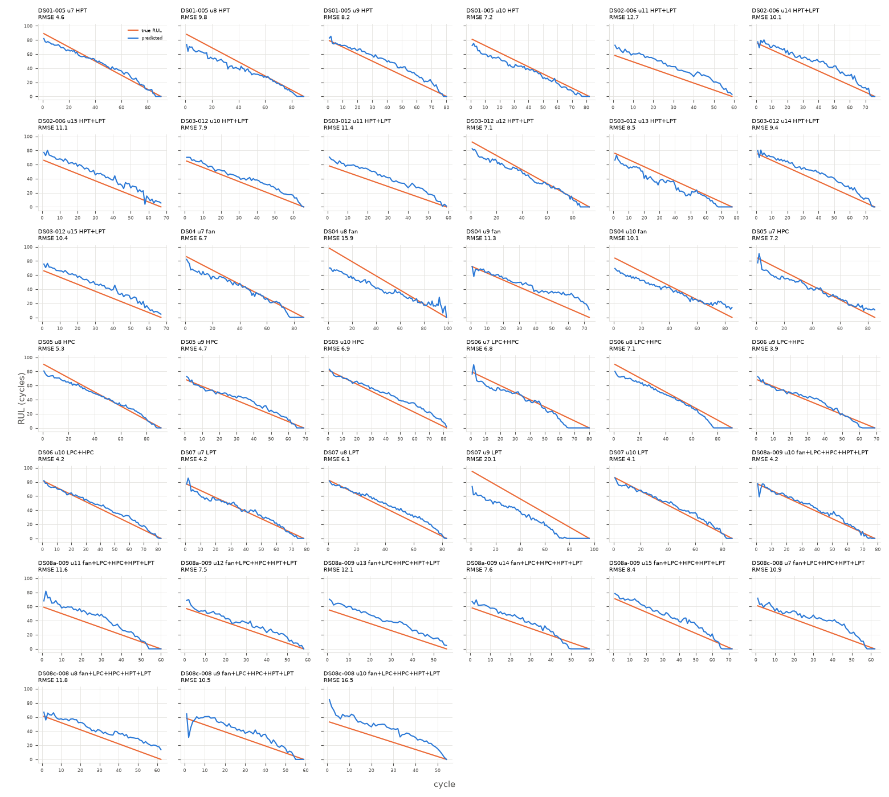

# linear

Uncapped RUL, every test cycle (n=2938 cycles, 39 engines).

**RMSE 9.466**, MAE 7.649, mean bias 1.693, std ratio 0.908.

## By subset

| subset    |   engines |   cycles |   rmse |   bias |
|:----------|----------:|---------:|-------:|-------:|
| DS01-005  |         4 |      341 |   7.69 |  -2.01 |
| DS02-006  |         3 |      202 |  11.24 |  10.42 |
| DS03-012  |         6 |      438 |   9.07 |   3.09 |
| DS04      |         4 |      344 |  11.66 |  -3.41 |
| DS05      |         4 |      327 |   6.15 |   0.67 |
| DS06      |         4 |      322 |   5.8  |  -2.01 |
| DS07      |         4 |      344 |  11.42 |  -3.8  |
| DS08a-009 |         6 |      383 |   8.77 |   6.7  |
| DS08c-008 |         4 |      237 |  12.53 |  10.72 |

## By components

| components          |   engines |   cycles |   rmse |   bias |
|:--------------------|----------:|---------:|-------:|-------:|
| HPC                 |         4 |      327 |   6.15 |   0.67 |
| HPT                 |         4 |      341 |   7.69 |  -2.01 |
| HPT+LPT             |         9 |      640 |   9.81 |   5.41 |
| LPC+HPC             |         4 |      322 |   5.8  |  -2.01 |
| LPT                 |         4 |      344 |  11.42 |  -3.8  |
| fan                 |         4 |      344 |  11.66 |  -3.41 |
| fan+LPC+HPC+HPT+LPT |        10 |      620 |  10.37 |   8.24 |

## By Fc

|   Fc |   engines |   cycles |   rmse |   bias |
|-----:|----------:|---------:|-------:|-------:|
|    1 |        13 |     1081 |   6.79 |   2.25 |
|    2 |        14 |     1022 |  10.7  |   2.31 |
|    3 |        12 |      835 |  10.75 |   0.22 |

## Worst engines

|                                             |   engines |   cycles |   rmse |   bias |
|:--------------------------------------------|----------:|---------:|-------:|-------:|
| ('DS07', 9, 'LPT', 3)                       |         1 |       96 |  20.15 | -18.97 |
| ('DS08c-008', 10, 'fan+LPC+HPC+HPT+LPT', 2) |         1 |       54 |  16.49 |  15.73 |
| ('DS04', 8, 'fan', 2)                       |         1 |       99 |  15.87 | -10.34 |
| ('DS02-006', 11, 'HPT+LPT', 3)              |         1 |       59 |  12.73 |  12.34 |
| ('DS08a-009', 13, 'fan+LPC+HPC+HPT+LPT', 3) |         1 |       56 |  12.14 |  11.87 |
| ('DS08c-008', 8, 'fan+LPC+HPC+HPT+LPT', 2)  |         1 |       62 |  11.81 |  10.83 |
| ('DS08a-009', 11, 'fan+LPC+HPC+HPT+LPT', 2) |         1 |       60 |  11.59 |   9.61 |
| ('DS03-012', 11, 'HPT+LPT', 3)              |         1 |       59 |  11.43 |  10.89 |



```json
{
  "cv_rmse_mean": 12.519,
  "cv_rmse_std": 2.071
}
```
