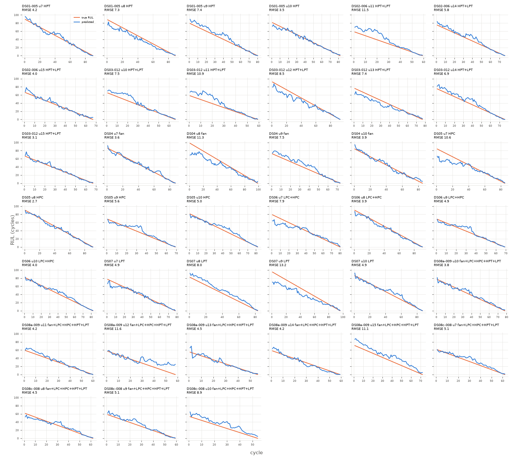

# xgboost

Uncapped RUL, every test cycle (n=2938 cycles, 39 engines).

**RMSE 7.095**, MAE 5.077, mean bias 0.787, std ratio 0.963.

## By subset

| subset    |   engines |   cycles |   rmse |   bias |
|:----------|----------:|---------:|-------:|-------:|
| DS01-005  |         4 |      341 |   5.87 |  -0.35 |
| DS02-006  |         3 |      202 |   7.52 |   4.61 |
| DS03-012  |         6 |      438 |   7.71 |   0.59 |
| DS04      |         4 |      344 |   7.46 |  -0.94 |
| DS05      |         4 |      327 |   6.66 |  -0.64 |
| DS06      |         4 |      322 |   5.41 |  -0.57 |
| DS07      |         4 |      344 |   8.69 |  -0.97 |
| DS08a-009 |         6 |      383 |   7.39 |   3.69 |
| DS08c-008 |         4 |      237 |   6.07 |   3.72 |

## By components

| components          |   engines |   cycles |   rmse |   bias |
|:--------------------|----------:|---------:|-------:|-------:|
| HPC                 |         4 |      327 |   6.66 |  -0.64 |
| HPT                 |         4 |      341 |   5.87 |  -0.35 |
| HPT+LPT             |         9 |      640 |   7.65 |   1.86 |
| LPC+HPC             |         4 |      322 |   5.41 |  -0.57 |
| LPT                 |         4 |      344 |   8.69 |  -0.97 |
| fan                 |         4 |      344 |   7.46 |  -0.94 |
| fan+LPC+HPC+HPT+LPT |        10 |      620 |   6.92 |   3.7  |

## By Fc

|   Fc |   engines |   cycles |   rmse |   bias |
|-----:|----------:|---------:|-------:|-------:|
|    1 |        13 |     1081 |   6.21 |   2.21 |
|    2 |        14 |     1022 |   7.03 |  -0.55 |
|    3 |        12 |      835 |   8.16 |   0.59 |

## Worst engines

|                                             |   engines |   cycles |   rmse |   bias |
|:--------------------------------------------|----------:|---------:|-------:|-------:|
| ('DS07', 9, 'LPT', 3)                       |         1 |       96 |  13.18 | -10.75 |
| ('DS08a-009', 12, 'fan+LPC+HPC+HPT+LPT', 3) |         1 |       58 |  11.58 |   7.35 |
| ('DS02-006', 11, 'HPT+LPT', 3)              |         1 |       59 |  11.49 |   8.66 |
| ('DS04', 8, 'fan', 2)                       |         1 |       99 |  11.28 |  -8.47 |
| ('DS08a-009', 15, 'fan+LPC+HPC+HPT+LPT', 1) |         1 |       72 |  11.08 |  10.35 |
| ('DS03-012', 11, 'HPT+LPT', 3)              |         1 |       59 |  10.89 |   7.91 |
| ('DS05', 7, 'HPC', 2)                       |         1 |       85 |  10.64 |  -6.19 |
| ('DS08c-008', 10, 'fan+LPC+HPC+HPT+LPT', 2) |         1 |       54 |   8.93 |   8.12 |



```json
{
  "cv_rmse_mean": 8.968,
  "cv_rmse_std": 1.015
}
```
